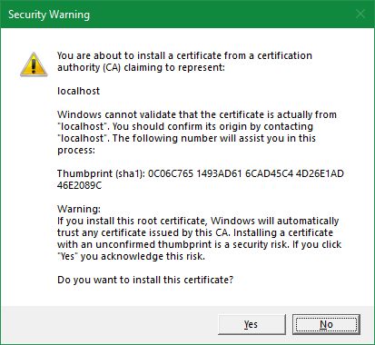
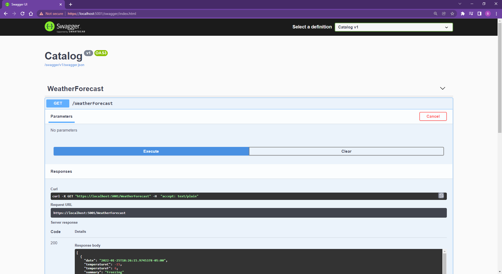
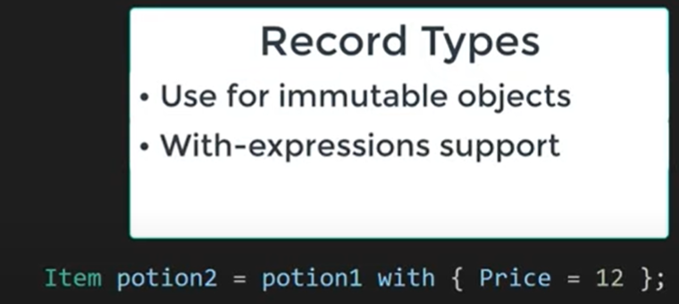
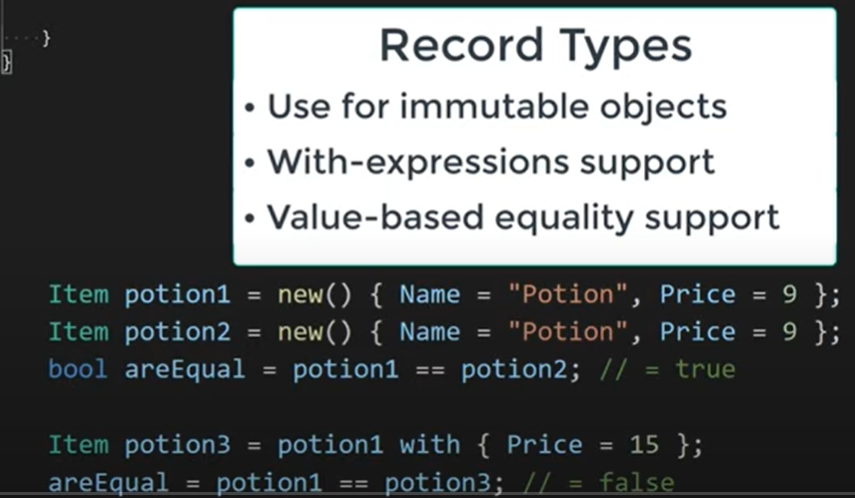
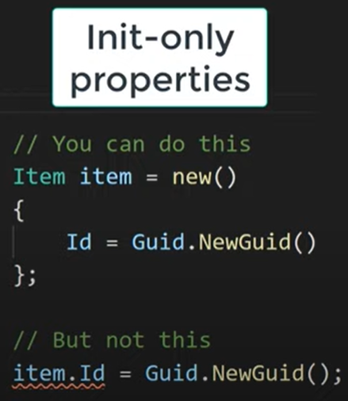
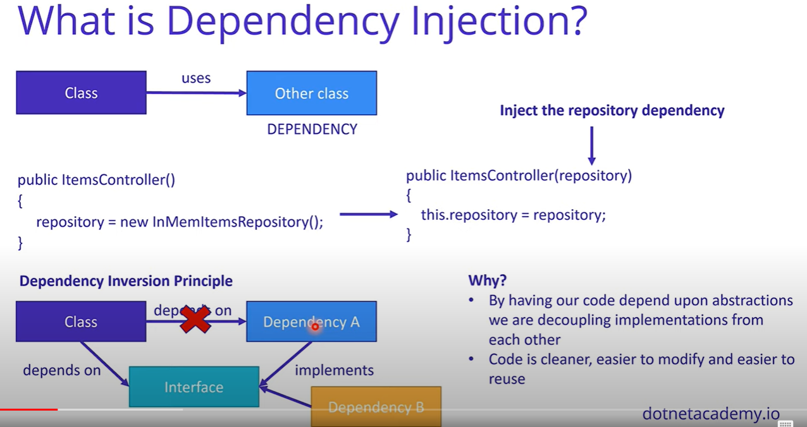
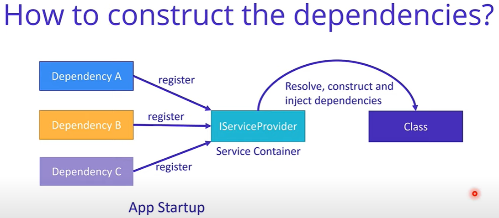

# .NET 5/6 REST API - Build From Scratch With C\#

.NET REST API - Build From Scratch With C#

## Keywords

entity, repository, contoller

C# record types

in-memory repositories

init-only properties

Target-typed new expression

Dependency Injection

DTO (Data Transfer Object)

ConfigureServices

Data Anotation

With-expressions

## Commands

```dos
dotnet new webapi -n Catalog
dotnet dev-certs https --trust
```

## Log

### .Net 6.x.x - aborted

```dos
C:\Code\MyDotNet\DotNet5-REST>dotnet new webapi -n Catalog
The template "ASP.NET Core Web API" was created successfully.

Processing post-creation actions...
Running 'dotnet restore' on C:\Code\MyDotNet\DotNet5-REST\Catalog\Catalog.csproj...
  Determining projects to restore...
C:\Code\MyDotNet\DotNet5-REST\Catalog\Catalog.csproj : error NU1100: Unable to resolve 'Swashbuckle.AspNetCore (>= 6.2.3)' for 'net6.0'.
  Failed to restore C:\Code\MyDotNet\DotNet5-REST\Catalog\Catalog.csproj (in 217 ms).
Restore failed.
Post action failed.
Manual instructions: Run 'dotnet restore'
```

### .Net 5.0.404 - aborted

```dos
The installation was successful.

The following were installed at: 'C:\Program Files\dotnet\'
    • .NET SDK 5.0.404
    • .NET Runtime 5.0.13
    • ASP.NET Core Runtime 5.0.13
    • .NET Windows Desktop Runtime 5.0.13
```

```dos
C:\Code\MyDotNet\DotNet5-REST>dotnet new webapi -n Catalog

Welcome to .NET 5.0!
---------------------
SDK Version: 5.0.404

Telemetry
---------
The .NET tools collect usage data in order to help us improve your experience. It is collected by Microsoft and shared with the community. You can opt-out of telemetry by setting the DOTNET_CLI_TELEMETRY_OPTOUT environment variable to '1' or 'true' using your favorite shell.

Read more about .NET CLI Tools telemetry: https://aka.ms/dotnet-cli-telemetry

----------------
Installed an ASP.NET Core HTTPS development certificate.
To trust the certificate run 'dotnet dev-certs https --trust' (Windows and macOS only).
Learn about HTTPS: https://aka.ms/dotnet-https
----------------
Write your first app: https://aka.ms/dotnet-hello-world
Find out what's new: https://aka.ms/dotnet-whats-new
Explore documentation: https://aka.ms/dotnet-docs
Report issues and find source on GitHub: https://github.com/dotnet/core
Use 'dotnet --help' to see available commands or visit: https://aka.ms/dotnet-cli
--------------------------------------------------------------------------------------
Getting ready...
The template "ASP.NET Core Web API" was created successfully.

Processing post-creation actions...
Running 'dotnet restore' on Catalog\Catalog.csproj...
  Determining projects to restore...
C:\Code\MyDotNet\DotNet5-REST\Catalog\Catalog.csproj : error NU1100: Unable to resolve 'Swashbuckle.AspNetCore (>= 5.6.3)' for 'net5.0'.
  Failed to restore C:\Code\MyDotNet\DotNet5-REST\Catalog\Catalog.csproj (in 164 ms).
Restore failed.
Post action failed.
Description: Restore NuGet packages required by this project.
Manual instructions: Run 'dotnet restore'
```

### .Net 5.0.100 - yes!

```dos
The installation was successful.

The following were installed at: 'C:\Program Files\dotnet\'
    • .NET SDK 5.0.100
    • .NET Runtime 5.0.0
    • ASP.NET Core Runtime 5.0.0
    • .NET Windows Desktop Runtime 5.0.0
```

```dos
C:\Code\MyDotNet>dotnet new webapi -n Catalog
Getting ready...
The template "ASP.NET Core Web API" was created successfully.

Processing post-creation actions...
Running 'dotnet restore' on Catalog\Catalog.csproj...
  Determining projects to restore...
  Restored C:\Code\MyDotNet\Catalog\Catalog.csproj (in 10.06 sec).
Restore succeeded.
```

```dos
C:\Code\MyDotNet\DotNet5-REST\Catalog>dotnet dev-certs https --trust
Trusting the HTTPS development certificate was requested. A confirmation prompt will be displayed if the certificate was not previously trusted. Click yes on the prompt to trust the certificate.
A valid HTTPS certificate is already present.
```

Remove the following in launch.json

```dos
            // Enable launching a web browser when ASP.NET Core starts. For more information: https://aka.ms/VSCode-CS-LaunchJson-WebBrowser
            "serverReadyAction": {
                "action": "openExternally",
                "pattern": "\\bNow listening on:\\s+(https?://\\S+)"
            },
```

## Notes

### Catalog.csproj

project file

### Program.cs

App entry point

### Startup.cs

### WeatherForecast.cs

Model

### Controllers/WeatherForecastController.cs

Controller

### appsettings.json and appsettings.Development.json

Older version has them in the Properties folder.

### Properties/launchSettings.json

URLs

### .vscode/launch.json

Newer version dones't have them!

### .vscode/tasks.json

Newer version dones't have them!

## Misc

### Troubleshooting on Controller

[Route("[items]")]

has to be changed to -

[Route("items")]

### How do I make VS Code open files in a new tab?

1. Double-click your files instead of single-clicking. Instead of single clicking on your files, (like I do in the previous GIF) double-click. .

2. Right click your tab and select "Keep Open" ...

3. Use the (Ctrl + K Enter) keyboard shortcut. ...

4. Double-click the tab you want to keep open.

## URLs

https://localhost:5001/swagger/index.html

## Screenshot















```dos
        private readonly InMemItemsRepository repository;

        public ItemsController()
        {
            repository = new InMemItemsRepository();
        }
```

=>

```dos
        private readonly IItemsRepository repository;

        public ItemsController(IItemsRepository repository)
        {
            this.repository = repository;
        }
```
