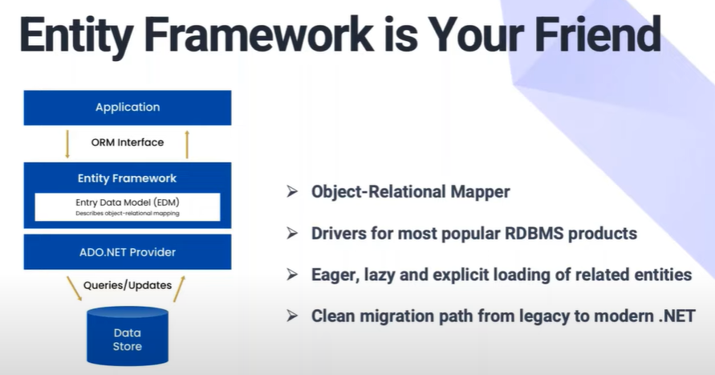

# MyDotNet

My .Net

## My .Net experience

### Project 4

- Built a new web app and a new tablet app and deployed to Azure Cloud for Ministry of Transportation and Mistry of Labour, Immigration, Training and Skills Development
  - For the offline mode tablet app, built the backend RESTful APIs with .Net, C#, LINQ, Entity Framework; created the responsive front-end UI with .NET MAUI, Telerik UI and DevTools to follow the Zeplin wireframes; and persisted data in SQLite.
  - For the online web app, created the backend RESTful APIs with .Net, C#, LINQ, Entity Framework; built the responsive front-end UI with Blazor, Telerik UI and DevTools to follow the Zeplin designs; and persisted data in Azure SQL database.
  - Performed the unit testing with NUnit and XUnit.
  - Automated the integration testing with Postman and Azure Data Studio.
  - Managed code repositories with Git and Azure DevOps.

### Project 3

- Modernized an on premise application built with C# .Net and MS SQL Server to AWS cloud with Amazon Relational Database Service for a bank client
  - Installed and configured AWS Toolkit for Visual Studio.
  - Switched on premise MS SQL Server to AWS RDS.
  - Scaled performance with asynchronous messaging.
  - Published ASP .NET Core application to AWS Elastic Beanstalk.
  - Added Docker support to ASP .NET application.
  - Packaged .NET application in Docker using MSIs.
  - Deployed to Docker containers Fargate.
  - Ensured containers’ Load Balancer can access RDS instance.

### Project 2

- For the client Hydro One, built and enhanced many Data, SAP, GIS, Web and Tablet applications (Java and C#) and provided production supports 24x7 for SLA level 1 or 2.

### Project 1

- Built the internal scorecard report application for Regional VPs to monitor and compare branches’ performance. Every month huge amount of data was transformed from IBM mainframe with JCL jobs, loaded with other legacy application data to MS SQL Server with SSIS, then created dashboards, KPIs and drill up or drill down reports with SSRS.
- Built the web app with C# and ASP .net.

### My Linked In posts

Got some new additions to my collection - Blazor + MAUI + Telerik.

## Modern .Net migration


## General


## ASP .Net core

ASP .Net AJAX -> ASP .Net MVC -> ASP .Net Core


## Entity Framework




## Front end : ASP .net or Angular/React

If you want a good alternative to Angular, I'd recommend you Blazor WebAssembly not exactly ASP .NET Core.

The only real alternative to Angular in the .NET Ecosystem is Blazor WebAssembly, where you can write SPA with C# or F# with the power of WebAssembly, this allows you to run your app without special configurations or IIS.

## C\#

### Using .Net Core + MVC + Swagger + VSCode

.NET 5 REST API Tutorial - Build From Scratch With C#

<https://www.youtube.com/watch?v=ZXdFisA_hOY>

.NET Core 3.1 MVC REST API - Full Course

<https://www.youtube.com/watch?v=fmvcAzHpsk8>


dotnet new ...

dotnet add ...

dotnet ef

```dos
[ApiController]
public class PeopleController : ControllerBase
{
    [HttpGet("people/all")]
    public ActionResult<IEnumerable<Person>> GetAll()
    {
        return new []
        {
            new Person { Name = "Ana" },
            new Person { Name = "Felipe" },
            new Person { Name = "Emillia" }
        };
    }
}

public class Person
{
    public string Name { get; set; }
}
```

### Web API

Visual Studio

### Refit

Visual Studio

Refit is a type-safe REST Client for . NET Core, Xamarin and . Net - developed by Paul Betts. It is inspired by Square's Retrofit library. Refit makes it relatively easy to make calls to REST API, without writing much of wrapping code.

## Entity Framework, EFCore

## MVC? Blazor? Razor Pages?

## Misc

Linq

Razor

MVC

the Repository Pattern, Dependency Injection, Entity Framework, Data Transfer Objects (DTOs), AutoMapper

## C# lint

StyleCop, Sonar, Resharper, Visual Studio and Roslyn

## .Net installation

[.Net installation](my_DotNetInstall.md)

## New targets

### Blazor

[My Blazor](my_Blazor.md)

### MAUI

.NET Multi-platform App UI documentation

.NET Multi-platform App UI (.NET MAUI) lets you build native apps using a .NET cross-platform UI toolkit that targets the mobile and desktop form factors on Android, iOS, macOS, Windows, and Tizen.

online + offline mode

[My MAUI](my_MAUI.md)

### Sqlite

Sqlite Studio 3.3.3

[My Sqlite](my_Sqlite.md)

## Playwright

Use it to do e2e

<https://playwright.dev/>

### Telerik

Progressive Telerik

[My Telerik](my_Telerik.md)

### WPF

Backup plan if MAUI doesn't work.

## Misc

### Visual Studio format code

To format a selection: Ctrl+K, Ctrl+F

To format a document: Ctrl+K, Ctrl+D

### PCF

### NgRx

NgRx Store provides reactive state management for Angular apps inspired by Redux. Unify the events in your application and derive state using RxJS.

Someone said - NgRx has so much boilerplate code and it’s syntax is not straight forward at all. Services and RxJs can do everything you want to accomplish with NgRx with none of the useless boilerplate code that is required by NgRx.

He suggested to use service + RxJs instead of NgRx.

## Interview Questions

[.Net Interview Questions](my_DotNetIwQ.md)

## Repos to clone

...
