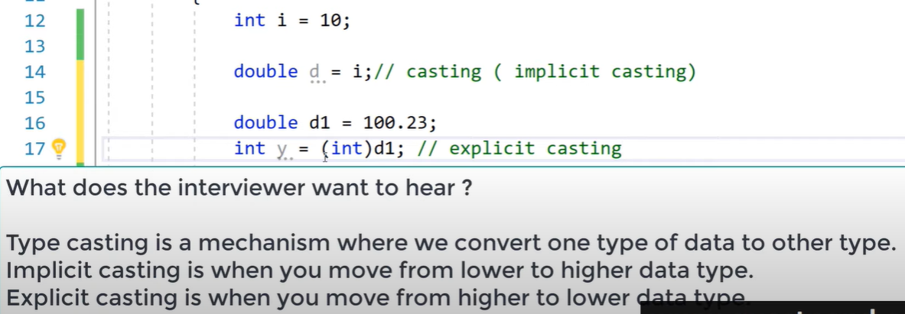

# MyDotNet

My .Net

## General


## Using HttpClient in .NET Core to Connect to APIs in C#


Razor page vs Razor component

Blazor

## Interview Questions


CLR does these 2 important things: IL and Garbage Collector.


C# is case-sensitive.

VB .Net is not case-sensitive - because it is basic!





## C#

### Using .Net Core + MVC + Swagger + VSCode!

.NET 5 REST API Tutorial - Build From Scratch With C#

https://www.youtube.com/watch?v=ZXdFisA_hOY

.NET Core 3.1 MVC REST API - Full Course

https://www.youtube.com/watch?v=fmvcAzHpsk8


dotnet new ...

dotnet add ...

dotnet ef

```dos
[ApiController]
public class PeopleController : ControllerBase
{
    [HttpGet("people/all")]
    public ActionResult<IEnumerable<Person>> GetAll()
    {
        return new []
        {
            new Person { Name = "Ana" },
            new Person { Name = "Felipe" },
            new Person { Name = "Emillia" }
        };
    }
}

public class Person
{
    public string Name { get; set; }
}
```

### Web API

Visual Studio

### Refit

Visual Studio

Refit is a type-safe REST Client for . NET Core, Xamarin and . Net - developed by Paul Betts. It is inspired by Square's Retrofit library. Refit makes it relatively easy to make calls to REST API, without writing much of wrapping code.

## Entity Framework, EFCore

## MVC? Blazor? Razor Pages?

## Misc

Linq

Razor

MVC

the Repository Pattern, Dependency Injection, Entity Framework, Data Transfer Objects (DTOs), AutoMapper

## C# lint

StyleCop, Sonar, Resharper, Visual Studio and Roslyn

## Local .Net installation

### Understand the CPU

To download .net core, there are 3 options for Windows - x64, x86, and Arm64.

Like x86 and x64, ARM is a different processor (CPU) architecture. The ARM architecture is typically used to build CPUs for a mobile device, ARM64 is simply an extension or evolution of the ARM architecture that supports 64-bit processing. Devices built on the ARM64 architecture include desktop PCs, mobile devices, and some IoT Core devices (Rasperry Pi 2, Raspberry Pi 3, and DragonBoard). For example the Microsoft HoloLens 2 uses an ARM64 processor.

How to Check if Processor is 32-bit, 64-bit, or ARM in Windows 10?

- Open the Settings app.
- Navigate to System > About.
- On the right, check out the System type value
- It shows either a x86-based processor (32-bit), x64-based processor (64-bit), or ARM-based processor depending on the hardware you have.


### .Net core 6.0

dotnet-sdk-6.0.201-win-x64.exe

### SQL Server 2019 Express

SQL2019-SSEI-Expr.exe

C:\Program Files\Microsoft SQL Server

Connection String:

Server=localhost\SQLEXPRESS;Database=master;Trusted_Connection=True;

SQL Server install log folder:

C:\Program Files\Microsoft SQL Server\150\Setup Bootstrap\Log\20220317_084609

Installation media folder:

C:\SQL2019\Express_ENU

Installation resource folder:

C:\Program Files\Microsoft SQL Server\150\SSEI\Resources


Connect SQL Server with SQL CMD:

`sqlcmd -S L113220\SQLEXPRESS -E`


### SQL Server Management Studio (SSMS) 18

SSMS-Setup-ENU.exe

C:\Program Files (x86)\Microsoft SQL Server Management Studio 18

### Visual Studio 2022 Preview Enterprise Edition

C:\Program Files\Microsoft Visual Studio\2022\Preview


## New targets

### Telerik

    Progressive Telerik

    Telerik UI for ASP.NET AJAX

### MAUI

    .NET Multi-platform App UI documentation

    .NET Multi-platform App UI (.NET MAUI) lets you build native apps using a .NET cross-platform UI toolkit that targets the mobile and desktop form factors on Android, iOS, macOS, Windows, and Tizen.

    online + offline mode

### Blazor

    Blazor is a free and open-source web framework that enables developers to create web apps using C# and HTML.

### Sqlite

Sqlite Studio 3.3.3

C:\Apps\SQLiteStudio\


### WPF

### PCF

### NgRx

NgRx Store provides reactive state management for Angular apps inspired by Redux. Unify the events in your application and derive state using RxJS.

Someone said - NgRx has so much boilerplate code and it’s syntax is not straight forward at all. Services and RxJs can do everything you want to accomplish with NgRx with none of the useless boilerplate code that is required by NgRx.

He suggested to use service + RxJs instead of NgRx.
