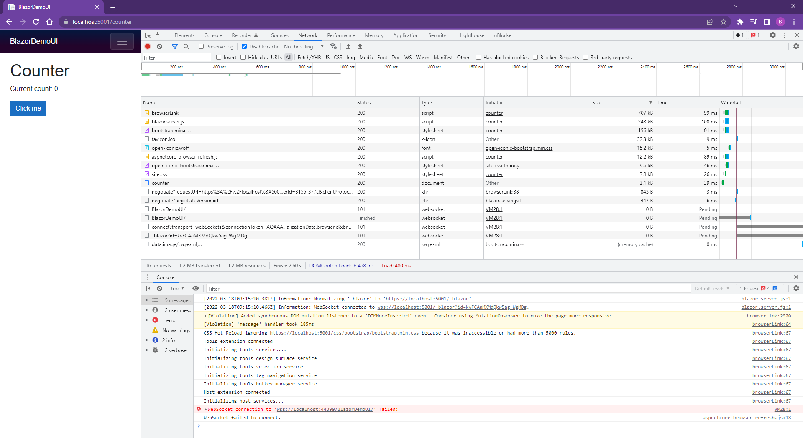
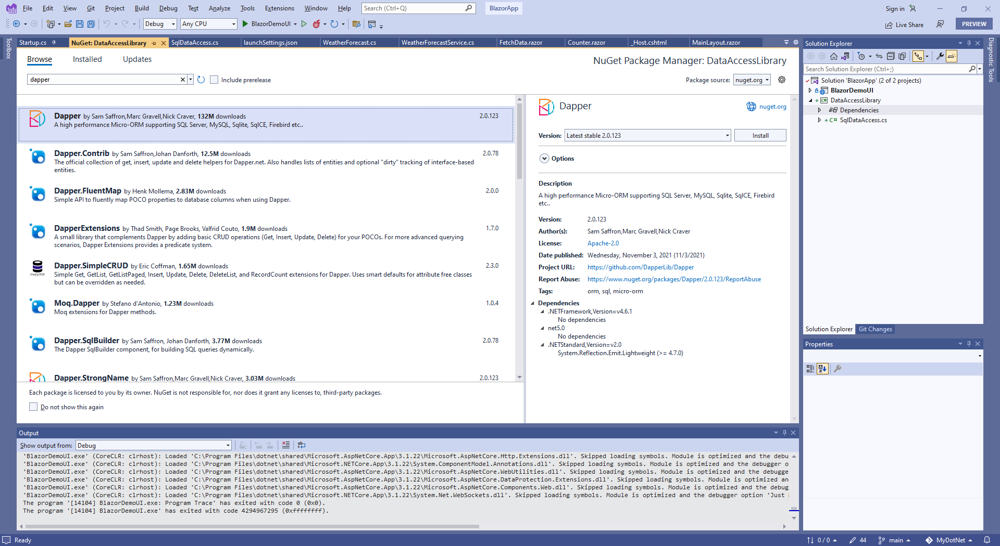
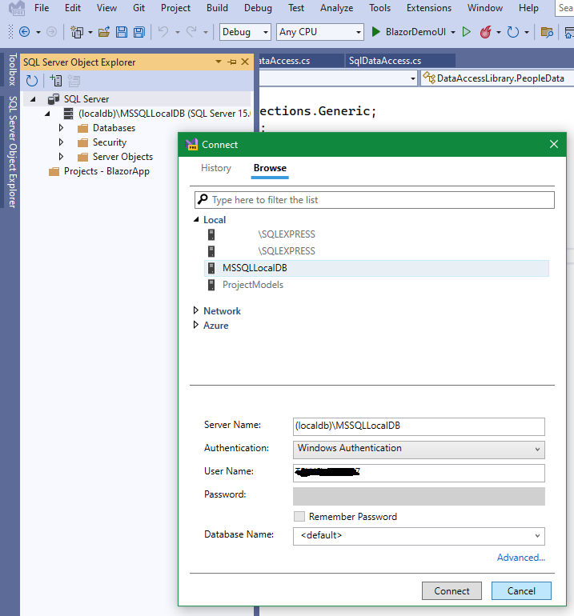

# Blazor

Blazor (Browser + Razor)

## Blazor vs Razor vs WebAssembly

Blazor is a relatively new Microsoft ASP.NET Core web framework that allows developers to write code for browsers in C#. Blazor is based on existing web technologies like HTML and CSS but then allows the developer to use C# and Razor syntax instead of JavaScript.

Razor is a popular template markup syntax for .NET.

Blazor (Browser + Razor) enables developers to build interactive and reusable web UI for client-side applications written in .NET and implemented under WebAssembly. With both client and server code written in C#, it allows you to share code and libraries, providing a platform to enable the development of vibrant, contemporary single-page applications (SPA) while using .NET end-to-end.

WebAssembly, often abbreviated Wasm, is a new standard that can be run in modern web browsers bringing language diversity to the web platform. Wasm is a low-level assembly-like language featuring a compact binary format that makes it possible to run code written in multiple languages such as C/C++, Java, and Rust on the web with near-native performance.

Blazor is a free and open-source web framework that enables developers to create web apps using C# and HTML.

Blazor Server vs. Blazor WebAssembly

Add a new item -> Razor Component

Razor Component vs Razor Page vs Razor View

oi is an open source icon library

@page

@variable

@event

@code

```
@page "/counter"

<h1>Counter</h1>

<p>Current count: @currentCount</p>

<button class="btn btn-primary" @onclick="IncrementCount">Click me</button>

@code {
    private int currentCount = 0;

    private void IncrementCount()
    {
        currentCount++;
    }
}
```


Razor page vs Razor component





@using

@inject

@if


### Features of Blazor

- Build Web UIs with C# instead of JavaScript or TypeScript
- Build progressive web apps (PWAs)
- Create and use reusable components written in C#
- Full debugging support on the server-side and debugging with some limitations on the client-side
- Data binding with the HTML DOM (limited two-way binding)
- Share code between client and server in C#
- Server and client-side models
- Server-side rendering (aka pre-rendering) for higher performance
- Ahead of time compilation
- Scoped styles
- WebSocket connections
- Works offline (client side WebAssembly only)
- Works in all modern web browsers including mobile browsers
- Blazor code has the same security sandbox as JavaScript
- Use JavaScript interop to call JavaScript frameworks and libraries
- Open source

## Dapper

Dapper is a simple object mapper for .NET that owns the title of King of Micro ORM in terms of speed, as it’s virtually as fast as using a raw ADO.NET data reader. It is available as a NuGet package. An ORM (object-relational mapper) is responsible for mapping databases and programming languages.

Dapper is database independent. It does not contain any database-specific implementation. Arguably, it is chosen by people who want to write their own SQL query. It simply provides extension methods for the IDbConnection interface which helps users to query and perform CRUD operations in databases.

Dapper is in production use at Stack Overflow.



ctor -> tab -> create a constructor

prop -> tab -> create a property

Control + .

Quick Actions and Refactorings (Control + .) -> Extract interface

SQL Server Object Expolorer



x.Server/Program.cs

```
global using BlazorFullStackCrud.Shared;
```

x.Client/Program.cs

```
global using BlazorFullStackCrud.Client.Services.SuperHeroService;
...
builder.Services.AddScoped<ISuperHeroService, SuperHeroService>();
```

```
https://localhost:7251/superheroes
https://localhost:7251/api/superhero
```

Use the @inject directive to inject the service into components. @inject has two parameters (type and name). Type represents the service type and name represents the service instance name.

```
@inject ServiceType ServiceInstanceName
```

## dotnet-ef

NuGet:

```
Microsoft.EntityFrameworkCore
Microsoft.EntityFrameworkCore.Design
Microsoft.EntityFrameworkCore.SqlServer
Microsoft.EntityFrameworkCore.Sqlite
```

```
dotnet tool install --global dotnet-ef
```

```
PM> dotnet tool install --global dotnet-ef
You can invoke the tool using the following command: dotnet-ef
Tool 'dotnet-ef' (version '6.0.3') was successfully installed.
```

```
dotnet-ef
```

```
PM> dotnet-ef

                     _/\__
               ---==/    \\
         ___  ___   |.    \|\
        | __|| __|  |  )   \\\
        | _| | _|   \_/ |  //|\\
        |___||_|       /   \\\/\\

Entity Framework Core .NET Command-line Tools 6.0.3

Usage: dotnet ef [options] [command]

Options:
  --version        Show version information
  -h|--help        Show help information
  -v|--verbose     Show verbose output.
  --no-color       Don't colorize output.
  --prefix-output  Prefix output with level.

Commands:
  database    Commands to manage the database.
  dbcontext   Commands to manage DbContext types.
  migrations  Commands to manage migrations.

Use "dotnet ef [command] --help" for more information about a command.
PM>
```

```
dotnet ef migrations add Initial
```

```
PM> dotnet ef migrations add Initial
Build started...
Build succeeded.
info: Microsoft.EntityFrameworkCore.Infrastructure[10403]
      Entity Framework Core 6.0.3 initialized 'DataContext' using provider 'Microsoft.EntityFrameworkCore.SqlServer:6.0.3' with options: None
Done. To undo this action, use 'ef migrations remove'
PM>
```

What is dotnet EF migrations?

Migration is a way to keep the database schema in sync with the EF Core model by preserving data.

EF Core migrations are a set of commands which you can execute in NuGet Package Manager Console or in dotnet Command Line Interface (CLI).


```
dotnet ef database update
```

```
PM> dotnet ef database update
Build started...
Build succeeded.
info: Microsoft.EntityFrameworkCore.Infrastructure[10403]
      Entity Framework Core 6.0.3 initialized 'DataContext' using provider 'Microsoft.EntityFrameworkCore.SqlServer:6.0.3' with options: None
info: Microsoft.EntityFrameworkCore.Database.Command[20101]
      Executed DbCommand (30ms) [Parameters=[], CommandType='Text', CommandTimeout='30']
      SELECT 1
info: Microsoft.EntityFrameworkCore.Database.Command[20101]
      Executed DbCommand (24ms) [Parameters=[], CommandType='Text', CommandTimeout='30']
      SELECT OBJECT_ID(N'[__EFMigrationsHistory]');
info: Microsoft.EntityFrameworkCore.Database.Command[20101]
      Executed DbCommand (2ms) [Parameters=[], CommandType='Text', CommandTimeout='30']
      SELECT 1
info: Microsoft.EntityFrameworkCore.Database.Command[20101]
      Executed DbCommand (3ms) [Parameters=[], CommandType='Text', CommandTimeout='30']
      CREATE TABLE [__EFMigrationsHistory] (
          [MigrationId] nvarchar(150) NOT NULL,
          [ProductVersion] nvarchar(32) NOT NULL,
          CONSTRAINT [PK___EFMigrationsHistory] PRIMARY KEY ([MigrationId])
      );
info: Microsoft.EntityFrameworkCore.Database.Command[20101]
      Executed DbCommand (0ms) [Parameters=[], CommandType='Text', CommandTimeout='30']
      SELECT 1
info: Microsoft.EntityFrameworkCore.Database.Command[20101]
      Executed DbCommand (2ms) [Parameters=[], CommandType='Text', CommandTimeout='30']
      SELECT OBJECT_ID(N'[__EFMigrationsHistory]');
info: Microsoft.EntityFrameworkCore.Database.Command[20101]
      Executed DbCommand (2ms) [Parameters=[], CommandType='Text', CommandTimeout='30']
      SELECT [MigrationId], [ProductVersion]
      FROM [__EFMigrationsHistory]
      ORDER BY [MigrationId];
info: Microsoft.EntityFrameworkCore.Migrations[20402]
      Applying migration '20220319003804_Initial'.
Applying migration '20220319003804_Initial'.
info: Microsoft.EntityFrameworkCore.Database.Command[20101]
      Executed DbCommand (4ms) [Parameters=[], CommandType='Text', CommandTimeout='30']
      CREATE TABLE [Comics] (
          [Id] int NOT NULL IDENTITY,
          [Name] nvarchar(max) NOT NULL,
          CONSTRAINT [PK_Comics] PRIMARY KEY ([Id])
      );
info: Microsoft.EntityFrameworkCore.Database.Command[20101]
      Executed DbCommand (4ms) [Parameters=[], CommandType='Text', CommandTimeout='30']
      CREATE TABLE [SuperHeroes] (
          [Id] int NOT NULL IDENTITY,
          [FirstName] nvarchar(max) NOT NULL,
          [LastName] nvarchar(max) NOT NULL,
          [HeroName] nvarchar(max) NOT NULL,
          [ComicId] int NOT NULL,
          CONSTRAINT [PK_SuperHeroes] PRIMARY KEY ([Id]),
          CONSTRAINT [FK_SuperHeroes_Comics_ComicId] FOREIGN KEY ([ComicId]) REFERENCES [Comics] ([Id]) ON DELETE CASCADE
      );
info: Microsoft.EntityFrameworkCore.Database.Command[20101]
      Executed DbCommand (20ms) [Parameters=[], CommandType='Text', CommandTimeout='30']
      IF EXISTS (SELECT * FROM [sys].[identity_columns] WHERE [name] IN (N'Id', N'Name') AND [object_id] = OBJECT_ID(N'[Comics]'))
          SET IDENTITY_INSERT [Comics] ON;
      INSERT INTO [Comics] ([Id], [Name])
      VALUES (1, N'Mavel');
      IF EXISTS (SELECT * FROM [sys].[identity_columns] WHERE [name] IN (N'Id', N'Name') AND [object_id] = OBJECT_ID(N'[Comics]'))
          SET IDENTITY_INSERT [Comics] OFF;
info: Microsoft.EntityFrameworkCore.Database.Command[20101]
      Executed DbCommand (9ms) [Parameters=[], CommandType='Text', CommandTimeout='30']
      IF EXISTS (SELECT * FROM [sys].[identity_columns] WHERE [name] IN (N'Id', N'Name') AND [object_id] = OBJECT_ID(N'[Comics]'))
          SET IDENTITY_INSERT [Comics] ON;
      INSERT INTO [Comics] ([Id], [Name])
      VALUES (2, N'DC');
      IF EXISTS (SELECT * FROM [sys].[identity_columns] WHERE [name] IN (N'Id', N'Name') AND [object_id] = OBJECT_ID(N'[Comics]'))
          SET IDENTITY_INSERT [Comics] OFF;
info: Microsoft.EntityFrameworkCore.Database.Command[20101]
      Executed DbCommand (10ms) [Parameters=[], CommandType='Text', CommandTimeout='30']
      IF EXISTS (SELECT * FROM [sys].[identity_columns] WHERE [name] IN (N'Id', N'ComicId', N'FirstName', N'HeroName', N'LastName') AND [object_id] = OBJECT_ID(N'[SuperHeroes]'))
          SET IDENTITY_INSERT [SuperHeroes] ON;
      INSERT INTO [SuperHeroes] ([Id], [ComicId], [FirstName], [HeroName], [LastName])
      VALUES (1, 1, N'Peter', N'SpiderMan', N'Parker');
      IF EXISTS (SELECT * FROM [sys].[identity_columns] WHERE [name] IN (N'Id', N'ComicId', N'FirstName', N'HeroName', N'LastName') AND [object_id] = OBJECT_ID(N'[SuperHeroes]'))
          SET IDENTITY_INSERT [SuperHeroes] OFF;
info: Microsoft.EntityFrameworkCore.Database.Command[20101]
      Executed DbCommand (9ms) [Parameters=[], CommandType='Text', CommandTimeout='30']
      IF EXISTS (SELECT * FROM [sys].[identity_columns] WHERE [name] IN (N'Id', N'ComicId', N'FirstName', N'HeroName', N'LastName') AND [object_id] = OBJECT_ID(N'[SuperHeroes]'))
          SET IDENTITY_INSERT [SuperHeroes] ON;
      INSERT INTO [SuperHeroes] ([Id], [ComicId], [FirstName], [HeroName], [LastName])
      VALUES (2, 2, N'Bruce', N'BatMan', N'Wayne');
      IF EXISTS (SELECT * FROM [sys].[identity_columns] WHERE [name] IN (N'Id', N'ComicId', N'FirstName', N'HeroName', N'LastName') AND [object_id] = OBJECT_ID(N'[SuperHeroes]'))
          SET IDENTITY_INSERT [SuperHeroes] OFF;
info: Microsoft.EntityFrameworkCore.Database.Command[20101]
      Executed DbCommand (21ms) [Parameters=[], CommandType='Text', CommandTimeout='30']
      CREATE INDEX [IX_SuperHeroes_ComicId] ON [SuperHeroes] ([ComicId]);
info: Microsoft.EntityFrameworkCore.Database.Command[20101]
      Executed DbCommand (1ms) [Parameters=[], CommandType='Text', CommandTimeout='30']
      INSERT INTO [__EFMigrationsHistory] ([MigrationId], [ProductVersion])
      VALUES (N'20220319003804_Initial', N'6.0.3');
Done.
PM>
```

## Blazor Routing

Routing in Blazor is achieved by providing a route template to each accessible component in the app with an @page directive.

When a Razor file with an @page directive is compiled, the generated class is given a RouteAttribute specifying the route template. At runtime, the router searches for component classes with a RouteAttribute and renders whichever component has a route template that matches the requested URL.

Asynchronous methods (async) don't support returning void

The Blazor framework doesn't track void-returning asynchronous methods (async). As a result, exceptions aren't caught if void is returned. Always return a Task from asynchronous methods.

To escape an @ symbol in Razor markup, use a second @ symbol:

```
<p>@@Username</p>
```

`App.razor`

Router?

```
<Router AppAssembly="@typeof(App).Assembly">
    <Found Context="routeData">
        <RouteView RouteData="@routeData" DefaultLayout="@typeof(MainLayout)" />
        <FocusOnNavigate RouteData="@routeData" Selector="h1" />
    </Found>
    <NotFound>
        <PageTitle>Not found</PageTitle>
        <LayoutView Layout="@typeof(MainLayout)">
            <p role="alert">Sorry, there's nothing at this address.</p>
        </LayoutView>
    </NotFound>
</Router>
```

## \_Imports.razor

Every folder of an app can optionally contain a template file named \_Imports.razor.

The \_Imports.razor file is similar to the \_ViewImports.cshtml file for Razor views and pages but applied specifically to Razor component files.

It's simply a file where you can put you using statements for all razor files and also if you to inject something on all pages you could add it there also.

You can also add [Authorize] there to make all pages require authorization as well, which is pretty nifty for a whitelist approach (add [AllowAnonymous] only if needed) if you're doing something like say an Admin portal.

## Task Class

Namespace: System.Threading.Tasks

Assembly: System.Runtime.dll

Represents an asynchronous operation.

The Task class represents a single operation that does not return a value and that usually executes asynchronously. Task objects are one of the central components of the task-based asynchronous pattern first introduced in the .NET Framework 4. Because the work performed by a Task object typically executes asynchronously on a thread pool thread rather than synchronously on the main application thread, you can use the Status property, as well as the IsCanceled, IsCompleted, and IsFaulted properties, to determine the state of a task. Most commonly, a lambda expression is used to specify the work that the task is to perform.

For operations that return values, you use the Task<TResult> class.

### TAP vs APM vs EAP

`Task-based asynchronous pattern (TAP)`

TAP uses a single method to represent the initiation and completion of an asynchronous operation. This contrasts with both the Asynchronous Programming Model (APM or IAsyncResult) pattern and the Event-based Asynchronous Pattern (EAP).

`Generate Angular and React components`

Generate framework-specific JavaScript (JS) components from Razor components for web frameworks, such as Angular or React. This capability isn't included with .NET 6, but is enabled by the new support for rendering Razor components from JS. The JS component generation sample on GitHub demonstrates how to generate Angular and React components from Razor components. See the GitHub sample app's README.md file for additional information.

Warning

The Angular and React component features are currently experimental, unsupported, and subject to change or be removed at any time. We welcome your feedback on how well this particular approach meets your requirements.

## ActionResult Class

Namespace: System.Web.Mvc

Assembly: System.Web.Mvc.dll

Package: Microsoft.AspNet.Mvc v5.2.6

Represents the result of an action method.

An ActionResult is a return type of a controller method, also called an action method, and serves as the base class for \*Result classes. Action methods return models to views, file streams, redirect to other controllers, or whatever is necessary for the task at hand.

IActionResult is an interface and ActionResult is an implementation of that interface in ASP.NET C#.

## Troubleshooting


aspnetcore-browser-refresh.js:234 WebSocket connection to 'wss://localhost:44392/BlazorFullStackCrud.Server/' failed: Error in connection establishment: net::ERR_CERT_AUTHORITY_INVALID


Someone said -

```
C:\Program Files (x86)\IIS Express\IisExpressAdminCmd.exe setupsslUrl -url:https://localhost:44392/ -UseSelfSigned
```

```
C:\WINDOWS\system32>cd C:\Program Files (x86)\IIS Express\

C:\Program Files (x86)\IIS Express>IisExpressAdminCmd.exe setupsslUrl -url:https://localhost:44392/ -UseSelfSigned
setupsslUrlCommand 'setupsslUrl' failed.
The requested operation requires elevation (Run as administrator).

C:\Program Files (x86)\IIS Express>IisExpressAdminCmd.exe setupsslUrl -url:https://localhost:44392/ -UseSelfSigned
Command 'setupsslUrl' completed.
```

However this doesn't work.

Changed to `<td>@hero.Comic?.Name</td>` to `<td>@hero.Comic?.Name</td>` resovled the null issue.

## Blazor vs Angular/React
