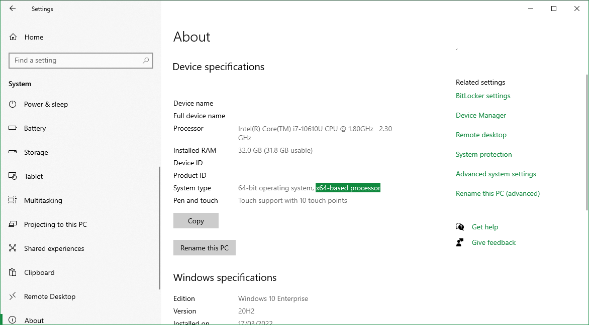
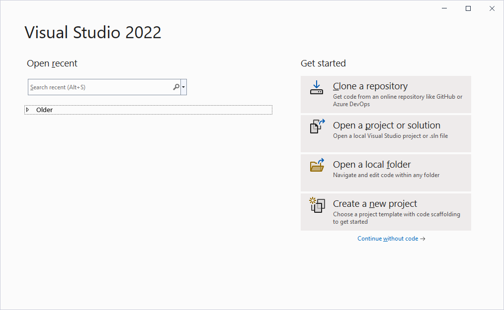
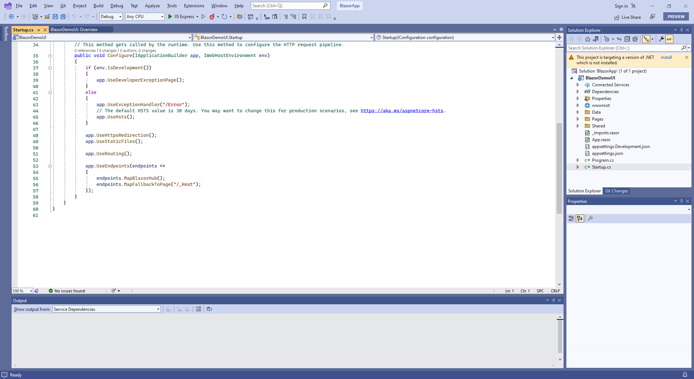

# .Net installation

My .Net installation in the local.

## Understand the CPU

To download .net core, there are 3 options for Windows - x64, x86, and Arm64.

Like x86 and x64, ARM is a different processor (CPU) architecture. The ARM architecture is typically used to build CPUs for a mobile device, ARM64 is simply an extension or evolution of the ARM architecture that supports 64-bit processing. Devices built on the ARM64 architecture include desktop PCs, mobile devices, and some IoT Core devices (Rasperry Pi 2, Raspberry Pi 3, and DragonBoard). For example the Microsoft HoloLens 2 uses an ARM64 processor.

How to Check if Processor is 32-bit, 64-bit, or ARM in Windows 10?

- Open the Settings app.
- Navigate to System > About.
- On the right, check out the System type value
- It shows either a x86-based processor (32-bit), x64-based processor (64-bit), or ARM-based processor depending on the hardware you have.

## .Net core 6.0

dotnet-sdk-6.0.201-win-x64.exe

.Net SDK 6.0.201

.Net runtime 6.0.3 (x64)

The folder is not under C:\Windows\Microsoft.NET\Framework or C:\Windows\Microsoft.NET\Framework64

## SQL Server 2019 Express

SQL2019-SSEI-Expr.exe

C:\Program Files\Microsoft SQL Server

Connection String:

Server=localhost\SQLEXPRESS;Database=master;Trusted_Connection=True;

SQL Server install log folder:

C:\Program Files\Microsoft SQL Server\150\Setup Bootstrap\Log\20220317_084609

Installation media folder:

C:\SQL2019\Express_ENU

Installation resource folder:

C:\Program Files\Microsoft SQL Server\150\SSEI\Resources

Connect SQL Server with SQL CMD:

`sqlcmd -S L113220\SQLEXPRESS -E`

## SQL Server Management Studio (SSMS) 18

SSMS-Setup-ENU.exe

C:\Program Files (x86)\Microsoft SQL Server Management Studio 18

## Visual Studio 2022 Preview Enterprise Edition

C:\Program Files\Microsoft Visual Studio\2022\Preview

