# MAUI

.NET Multi-platform App UI documentation

.NET Multi-platform App UI (.NET MAUI) lets you build native apps using a .NET cross-platform UI toolkit that targets the mobile and desktop form factors on Android, iOS, macOS, Windows, and Tizen.

.NET Multi-platform App UI (.NET MAUI) is a cross-platform framework for creating native mobile and desktop apps with C# and XAML. Using .NET MAUI, you can develop apps that can run on Android, iOS, iPadOS, macOS, and Windows from a single shared codebase.

`https://github.com/dotnet/maui`

## Modify Visual Studio installation

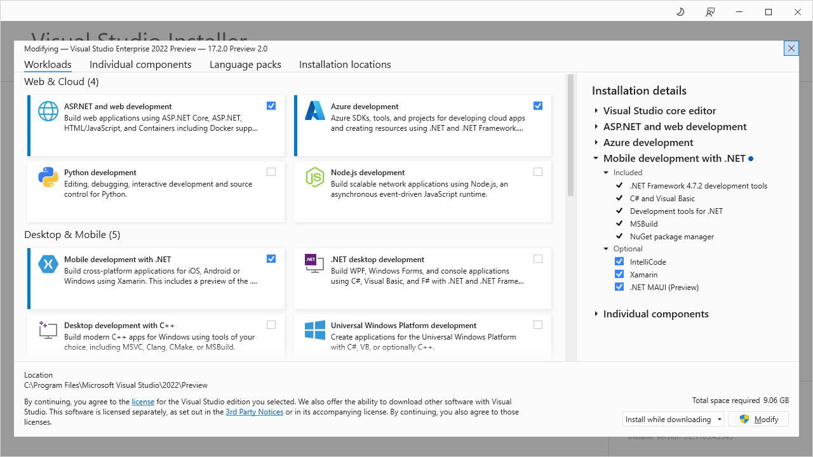

Tools > Get Tools and Features

## My MAUI

### My 1st MAUI app

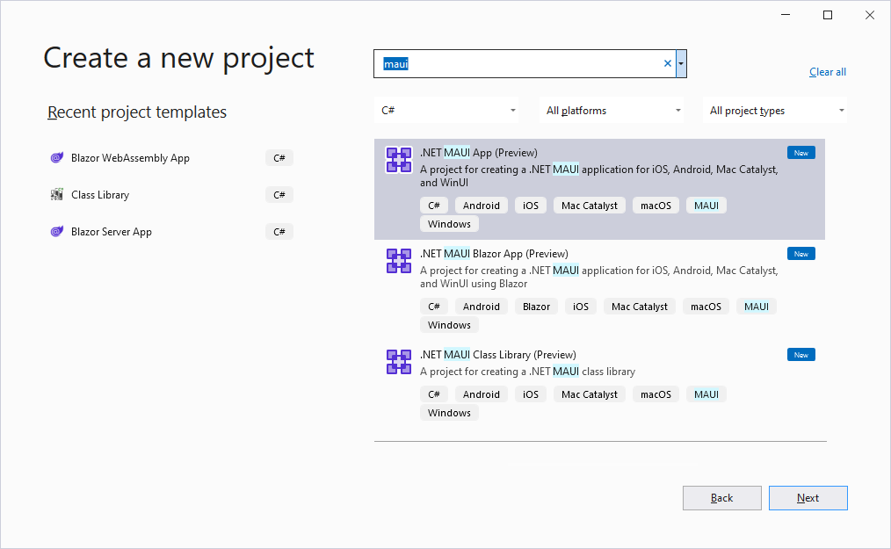


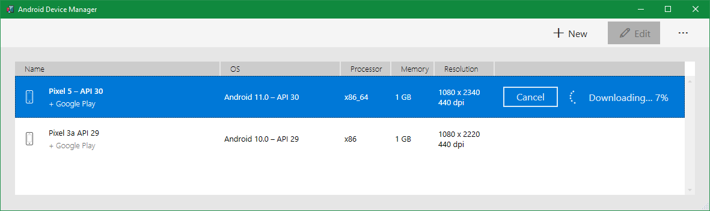

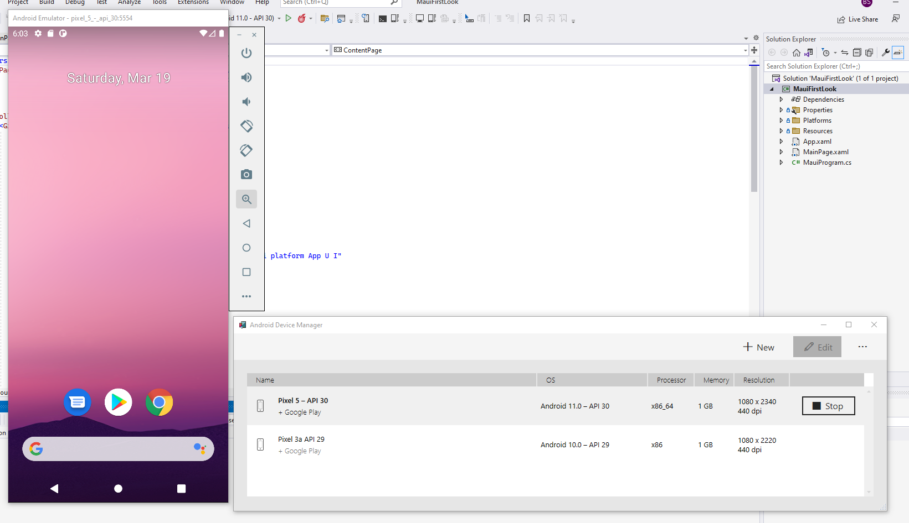

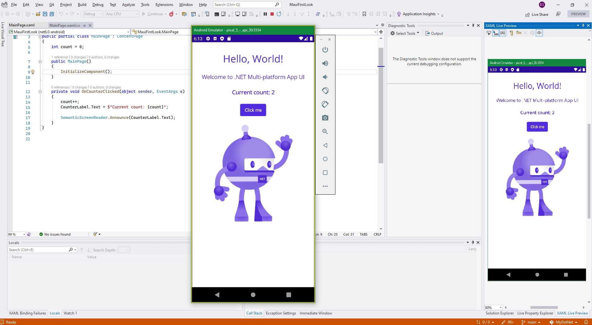

output

```
> am start -a "android.intent.action.MAIN" -c "android.intent.category.LAUNCHER" -n "com.companyname.mauifirstlook/crc640020de5bcf9d6005.MainActivity"
> Starting: Intent { act=android.intent.action.MAIN cat=[android.intent.category.LAUNCHER] cmp=com.companyname.mauifirstlook/crc640020de5bcf9d6005.MainActivity }
Loaded assembly: /data/data/com.companyname.mauifirstlook/files/.__override__/MauiFirstLook.dll
Loaded assembly: /data/data/com.companyname.mauifirstlook/files/.__override__/Mono.Android.dll [External]
Loaded assembly: /data/data/com.companyname.mauifirstlook/files/.__override__/System.Runtime.dll [External]
Loaded assembly: /data/data/com.companyname.mauifirstlook/files/.__override__/Java.Interop.dll [External]
Loaded assembly: /data/data/com.companyname.mauifirstlook/files/.__override__/System.Collections.dll [External]
Resolved pending breakpoint for 'Android.Runtime.JNIEnv.RegisterJniNatives(System.IntPtr, System.Int32, System.IntPtr, System.IntPtr, System.Int32)' to /Users/runner/work/1/s/xamarin-android/src/Mono.Android/Android.Runtime/JNIEnv.cs:124 [0x00000].
Loaded assembly: /data/data/com.companyname.mauifirstlook/files/.__override__/System.Threading.dll [External]
Loaded assembly: /data/data/com.companyname.mauifirstlook/files/.__override__/System.Runtime.InteropServices.dll [External]
Loaded assembly: /data/data/com.companyname.mauifirstlook/files/.__override__/System.Threading.Thread.dll [External]
Loaded assembly: /data/data/com.companyname.mauifirstlook/files/.__override__/System.Diagnostics.StackTrace.dll [External]
Loaded assembly: data-0x79cf1272c020 [External]
Loaded assembly: data-0x79cf1273c030 [External]
Loaded assembly: data-0x79cd0a4b7040 [External]
Loaded assembly: data-0x79cf1277c070 [External]
Loaded assembly: /data/data/com.companyname.mauifirstlook/files/.__override__/netstandard.dll [External]
Loaded assembly: /data/data/com.companyname.mauifirstlook/files/.__override__/System.Linq.dll [External]
Loaded assembly: /data/data/com.companyname.mauifirstlook/files/.__override__/System.Collections.Concurrent.dll [External]
Resolved pending breakpoint for 'Xamarin.HotReload.HotReloadAgent.BreakpointSendToIde(System.String)' to D:\a\_work\1\s\HotReload\Source\Xamarin.HotReload.Agent\HotReloadAgent.cs:415 [0x00000].
Loaded assembly: /data/data/com.companyname.mauifirstlook/files/.__override__/System.Text.Json.dll [External]
Loaded assembly: /data/data/com.companyname.mauifirstlook/files/.__override__/System.Text.Encodings.Web.dll [External]
Loaded assembly: /data/data/com.companyname.mauifirstlook/files/.__override__/System.ComponentModel.dll [External]
Loaded assembly: /data/data/com.companyname.mauifirstlook/files/.__override__/Microsoft.Maui.Controls.dll [External]
Loaded assembly: /data/data/com.companyname.mauifirstlook/files/.__override__/System.ObjectModel.dll [External]
Loaded assembly: /data/data/com.companyname.mauifirstlook/files/.__override__/Microsoft.Maui.dll [External]
Loaded assembly: /data/data/com.companyname.mauifirstlook/files/.__override__/Microsoft.Maui.Graphics.dll [External]
Loaded assembly: /data/data/com.companyname.mauifirstlook/files/.__override__/Microsoft.Maui.Essentials.dll [External]
Loaded assembly: /data/data/com.companyname.mauifirstlook/files/.__override__/Microsoft.Extensions.Logging.Abstractions.dll [External]
Loaded assembly: /data/data/com.companyname.mauifirstlook/files/.__override__/System.Runtime.Loader.dll [External]
Resolved pending breakpoint for 'Xamarin.HotReload.HotReloadAgent.BreakpointCheckpoint()' to D:\a\_work\1\s\HotReload\Source\Xamarin.HotReload.Agent\HotReloadAgent.cs:410 [0x00000].
Loaded assembly: /data/data/com.companyname.mauifirstlook/files/.__override__/System.Memory.dll [External]
Loaded assembly: /data/data/com.companyname.mauifirstlook/files/.__override__/System.Reflection.Emit.Lightweight.dll [External]
Loaded assembly: /data/data/com.companyname.mauifirstlook/files/.__override__/System.Reflection.Emit.ILGeneration.dll [External]
Loaded assembly: /data/data/com.companyname.mauifirstlook/files/.__override__/System.Reflection.Primitives.dll [External]
Loaded assembly: /data/data/com.companyname.mauifirstlook/files/.__override__/System.Runtime.CompilerServices.Unsafe.dll [External]
Loaded assembly: /data/data/com.companyname.mauifirstlook/files/.__override__/Xamarin.AndroidX.Core.dll [External]
Loaded assembly: /data/data/com.companyname.mauifirstlook/files/.__override__/Microsoft.Extensions.DependencyInjection.Abstractions.dll [External]
Loaded assembly: /data/data/com.companyname.mauifirstlook/files/.__override__/Microsoft.Maui.Controls.Compatibility.dll [External]
Loaded assembly: /data/data/com.companyname.mauifirstlook/files/.__override__/Microsoft.Extensions.Configuration.dll [External]
Loaded assembly: /data/data/com.companyname.mauifirstlook/files/.__override__/Microsoft.Extensions.Configuration.Abstractions.dll [External]
Loaded assembly: /data/data/com.companyname.mauifirstlook/files/.__override__/Microsoft.Extensions.Logging.dll [External]
Loaded assembly: /data/data/com.companyname.mauifirstlook/files/.__override__/Microsoft.Extensions.Primitives.dll [External]
Loaded assembly: /data/data/com.companyname.mauifirstlook/files/.__override__/Microsoft.Maui.Controls.Xaml.dll [External]
Loaded assembly: /data/data/com.companyname.mauifirstlook/files/.__override__/Xamarin.AndroidX.AppCompat.dll [External]
Loaded assembly: /data/data/com.companyname.mauifirstlook/files/.__override__/Xamarin.Google.Android.Material.dll [External]
Loaded assembly: /data/data/com.companyname.mauifirstlook/files/.__override__/System.ComponentModel.TypeConverter.dll [External]
Loaded assembly: /data/data/com.companyname.mauifirstlook/files/.__override__/System.Private.Uri.dll [External]
Loaded assembly: /data/data/com.companyname.mauifirstlook/files/.__override__/Xamarin.AndroidX.DrawerLayout.dll [External]
Loaded assembly: /data/data/com.companyname.mauifirstlook/files/.__override__/Xamarin.AndroidX.CustomView.dll [External]
Loaded assembly: /data/data/com.companyname.mauifirstlook/files/.__override__/Xamarin.AndroidX.Navigation.Runtime.dll [External]
Loaded assembly: /data/data/com.companyname.mauifirstlook/files/.__override__/Microsoft.Extensions.DependencyInjection.dll [External]
Loaded assembly: /data/data/com.companyname.mauifirstlook/files/.__override__/System.Diagnostics.Tracing.dll [External]
Loaded assembly: /data/data/com.companyname.mauifirstlook/files/.__override__/Microsoft.Extensions.Options.dll [External]
Loaded assembly: /data/data/com.companyname.mauifirstlook/files/.__override__/System.Linq.Expressions.dll [External]
Loaded assembly: /data/data/com.companyname.mauifirstlook/files/.__override__/System.Xml.ReaderWriter.dll [External]
Loaded assembly: /data/data/com.companyname.mauifirstlook/files/.__override__/System.Private.Xml.dll [External]
Loaded assembly: /data/data/com.companyname.mauifirstlook/files/.__override__/System.Text.Encoding.Extensions.dll [External]
Loaded assembly: /data/data/com.companyname.mauifirstlook/files/.__override__/System.Text.RegularExpressions.dll [External]
Loaded assembly: /data/data/com.companyname.mauifirstlook/files/.__override__/System.Numerics.Vectors.dll [External]
Resolved pending breakpoint at 'MainPage.xaml.cs:14,1' to void MauiFirstLook.MainPage.OnCounterClicked (object sender, System.EventArgs e) [0x00001].
[e.mauifirstloo] Late-enabling -Xcheck:jni
[e.mauifirstloo] Unquickening 12 vdex files!
[e.mauifirstloo] Unexpected CPU variant for X86 using defaults: x86_64
[NetworkSecurityConfig] No Network Security Config specified, using platform default
[NetworkSecurityConfig] No Network Security Config specified, using platform default
[debug-app-helper] Checking if libmonodroid was unpacked to /data/app/~~9TiP5_BkOZSnKrSEY55yTQ==/com.companyname.mauifirstlook-qA9ks7kvQxZnhTdA01V8cA==/lib/x86_64/libmonodroid.so
[debug-app-helper] Native libs extracted to /data/app/~~9TiP5_BkOZSnKrSEY55yTQ==/com.companyname.mauifirstlook-qA9ks7kvQxZnhTdA01V8cA==/lib/x86_64, assuming application/android:extractNativeLibs == true
[debug-app-helper] Setting up for DSO lookup in app data directories
[debug-app-helper] Added filesystem DSO lookup location: /data/app/~~9TiP5_BkOZSnKrSEY55yTQ==/com.companyname.mauifirstlook-qA9ks7kvQxZnhTdA01V8cA==/lib/x86_64
[debug-app-helper] Using runtime path: /data/app/~~9TiP5_BkOZSnKrSEY55yTQ==/com.companyname.mauifirstlook-qA9ks7kvQxZnhTdA01V8cA==/lib/x86_64
[debug-app-helper] checking directory: `/data/user/0/com.companyname.mauifirstlook/files/.__override__/lib`
[debug-app-helper] directory does not exist: `/data/user/0/com.companyname.mauifirstlook/files/.__override__/lib`
[debug-app-helper] Checking whether Mono runtime exists at: /data/user/0/com.companyname.mauifirstlook/files/.__override__/libmonosgen-2.0.so
[debug-app-helper] Checking whether Mono runtime exists at: /data/app/~~9TiP5_BkOZSnKrSEY55yTQ==/com.companyname.mauifirstlook-qA9ks7kvQxZnhTdA01V8cA==/lib/x86_64/libmonosgen-2.0.so
[debug-app-helper] Mono runtime found at: /data/app/~~9TiP5_BkOZSnKrSEY55yTQ==/com.companyname.mauifirstlook-qA9ks7kvQxZnhTdA01V8cA==/lib/x86_64/libmonosgen-2.0.so
[e.mauifirstloo] Attempt to remove non-JNI local reference, dumping thread
[DOTNET] JNI_OnLoad: JNI_OnLoad in pal_jni.c
[monodroid] Creating public update directory: `/data/user/0/com.companyname.mauifirstlook/files/.__override__`
[e.mauifirstloo] Attempt to remove non-JNI local reference, dumping thread
[monodroid-debug] Trying to initialize the debugger with options: --debugger-agent=transport=dt_socket,loglevel=0,address=10.0.2.2:50779,embedding=1
[monodroid-assembly] open_from_bundles: failed to load assembly MauiFirstLook.dll
[monodroid-gc] GREF GC Threshold: 46080
[monodroid-assembly] open_from_bundles: failed to load assembly Mono.Android.dll
[monodroid-assembly] open_from_bundles: failed to load assembly System.Runtime.dll
[monodroid-assembly] open_from_bundles: failed to load assembly Java.Interop.dll
[monodroid-assembly] open_from_bundles: failed to load assembly System.Collections.dll
[monodroid-assembly] open_from_bundles: failed to load assembly System.Threading.dll
[monodroid-assembly] open_from_bundles: failed to load assembly System.Runtime.InteropServices.dll
[monodroid-assembly] open_from_bundles: failed to load assembly System.Threading.Thread.dll
[monodroid-assembly] open_from_bundles: failed to load assembly System.Diagnostics.StackTrace.dll
[e.mauifirstloo] Attempt to remove non-JNI local reference, dumping thread
[monodroid-assembly] open_from_bundles: failed to load assembly netstandard.dll
[monodroid-assembly] open_from_bundles: failed to load assembly System.Linq.dll
[monodroid-assembly] open_from_bundles: failed to load assembly Microsoft.VisualStudio.DesignTools.TapContract.dll
[monodroid-assembly] open_from_bundles: failed to load assembly Microsoft.VisualStudio.DesignTools.TapContract.dll
[monodroid-assembly] open_from_bundles: failed to load assembly Xamarin.HotReload.Contracts.dll
[monodroid-assembly] open_from_bundles: failed to load assembly Xamarin.HotReload.Contracts.dll
[monodroid-assembly] open_from_bundles: failed to load assembly System.Collections.Concurrent.dll
[monodroid-assembly] open_from_bundles: failed to load assembly System.Text.Json.dll
[monodroid-assembly] open_from_bundles: failed to load assembly System.Text.Encodings.Web.dll
[monodroid-assembly] open_from_bundles: failed to load assembly System.ComponentModel.dll
[monodroid-assembly] open_from_bundles: failed to load assembly Microsoft.Maui.Controls.dll
[monodroid-assembly] open_from_bundles: failed to load assembly Xamarin.HotReload.Contracts.dll
[monodroid-assembly] open_from_bundles: failed to load assembly Xamarin.HotReload.Contracts.dll
[monodroid-assembly] open_from_bundles: failed to load assembly Microsoft.VisualStudio.DesignTools.TapContract.dll
[monodroid-assembly] open_from_bundles: failed to load assembly Microsoft.VisualStudio.DesignTools.TapContract.dll
[monodroid-assembly] open_from_bundles: failed to load assembly System.ObjectModel.dll
[monodroid-assembly] open_from_bundles: failed to load assembly Microsoft.Maui.dll
[monodroid-assembly] open_from_bundles: failed to load assembly Microsoft.Maui.Graphics.dll
[monodroid-assembly] open_from_bundles: failed to load assembly Microsoft.Maui.Essentials.dll
[monodroid-assembly] open_from_bundles: failed to load assembly Microsoft.Extensions.Logging.Abstractions.dll
[monodroid-assembly] open_from_bundles: failed to load assembly System.Runtime.Loader.dll
[monodroid-assembly] open_from_bundles: failed to load assembly System.Memory.dll
[monodroid-assembly] open_from_bundles: failed to load assembly System.Reflection.Emit.Lightweight.dll
[monodroid-assembly] open_from_bundles: failed to load assembly System.Reflection.Emit.ILGeneration.dll
[monodroid-assembly] open_from_bundles: failed to load assembly System.Reflection.Primitives.dll
[monodroid-assembly] open_from_bundles: failed to load assembly System.Runtime.CompilerServices.Unsafe.dll
[monodroid-assembly] open_from_bundles: failed to load assembly Xamarin.AndroidX.Core.dll
[monodroid-assembly] open_from_bundles: failed to load assembly Microsoft.Extensions.DependencyInjection.Abstractions.dll
[monodroid-assembly] open_from_bundles: failed to load assembly Microsoft.Maui.Controls.Compatibility.dll
[monodroid-assembly] open_from_bundles: failed to load assembly Microsoft.Extensions.Configuration.dll
[monodroid-assembly] open_from_bundles: failed to load assembly Microsoft.Extensions.Configuration.Abstractions.dll
[monodroid-assembly] open_from_bundles: failed to load assembly Microsoft.Extensions.Logging.dll
[monodroid-assembly] open_from_bundles: failed to load assembly Microsoft.Extensions.Primitives.dll
[monodroid-assembly] open_from_bundles: failed to load assembly Microsoft.Maui.Controls.Xaml.dll
[monodroid-assembly] open_from_bundles: failed to load assembly Xamarin.AndroidX.AppCompat.dll
[monodroid-assembly] open_from_bundles: failed to load assembly Xamarin.Google.Android.Material.dll
[monodroid-assembly] open_from_bundles: failed to load assembly System.ComponentModel.TypeConverter.dll
[monodroid-assembly] open_from_bundles: failed to load assembly System.Private.Uri.dll
[monodroid-assembly] open_from_bundles: failed to load assembly Xamarin.AndroidX.DrawerLayout.dll
[monodroid-assembly] open_from_bundles: failed to load assembly Xamarin.AndroidX.CustomView.dll
[monodroid-assembly] open_from_bundles: failed to load assembly Xamarin.AndroidX.Navigation.Runtime.dll
[monodroid-assembly] open_from_bundles: failed to load assembly Microsoft.Extensions.DependencyInjection.dll
[monodroid-assembly] open_from_bundles: failed to load assembly System.Diagnostics.Tracing.dll
[monodroid-assembly] open_from_bundles: failed to load assembly Microsoft.Extensions.Options.dll
[monodroid-assembly] open_from_bundles: failed to load assembly System.Linq.Expressions.dll
[monodroid-assembly] open_from_bundles: failed to load assembly System.Xml.ReaderWriter.dll
[monodroid-assembly] open_from_bundles: failed to load assembly System.Private.Xml.dll
[monodroid-assembly] open_from_bundles: failed to load assembly System.Text.Encoding.Extensions.dll
[monodroid-assembly] open_from_bundles: failed to load assembly System.Text.RegularExpressions.dll
[monodroid-assembly] open_from_bundles: failed to load assembly System.Numerics.Vectors.dll
[monodroid-assembly] open_from_bundles: failed to load assembly Xamarin.AndroidX.SwipeRefreshLayout.dll
[monodroid-assembly] open_from_bundles: failed to load assembly Xamarin.AndroidX.CardView.dll
[monodroid-assembly] open_from_bundles: failed to load assembly Microsoft.Maui.Controls.Compatibility.Android.FormsViewGroup.dll
[monodroid-assembly] open_from_bundles: failed to load assembly Xamarin.AndroidX.RecyclerView.dll
[monodroid-assembly] open_from_bundles: failed to load assembly Xamarin.AndroidX.ViewPager.dll
[monodroid-assembly] open_from_bundles: failed to load assembly Xamarin.AndroidX.Fragment.dll
Loaded assembly: /data/data/com.companyname.mauifirstlook/files/.__override__/Xamarin.AndroidX.SwipeRefreshLayout.dll [External]
Loaded assembly: /data/data/com.companyname.mauifirstlook/files/.__override__/Xamarin.AndroidX.CardView.dll [External]
Loaded assembly: /data/data/com.companyname.mauifirstlook/files/.__override__/Microsoft.Maui.Controls.Compatibility.Android.FormsViewGroup.dll [External]
Loaded assembly: /data/data/com.companyname.mauifirstlook/files/.__override__/Xamarin.AndroidX.RecyclerView.dll [External]
Loaded assembly: /data/data/com.companyname.mauifirstlook/files/.__override__/Xamarin.AndroidX.ViewPager.dll [External]
Loaded assembly: /data/data/com.companyname.mauifirstlook/files/.__override__/Xamarin.AndroidX.Fragment.dll [External]
[libEGL] loaded /vendor/lib64/egl/libEGL_emulation.so
[libEGL] loaded /vendor/lib64/egl/libGLESv1_CM_emulation.so
[libEGL] loaded /vendor/lib64/egl/libGLESv2_emulation.so
[monodroid-assembly] open_from_bundles: failed to load assembly Xamarin.AndroidX.Activity.dll
[monodroid-assembly] open_from_bundles: failed to load assembly Xamarin.AndroidX.Lifecycle.Common.dll
[monodroid-assembly] open_from_bundles: failed to load assembly Xamarin.AndroidX.Lifecycle.ViewModel.dll
[monodroid-assembly] open_from_bundles: failed to load assembly Xamarin.AndroidX.SavedState.dll
[monodroid-assembly] open_from_bundles: failed to load assembly Xamarin.AndroidX.Loader.dll
Loaded assembly: /data/data/com.companyname.mauifirstlook/files/.__override__/Xamarin.AndroidX.Activity.dll [External]
Loaded assembly: /data/data/com.companyname.mauifirstlook/files/.__override__/Xamarin.AndroidX.Lifecycle.Common.dll [External]
Loaded assembly: /data/data/com.companyname.mauifirstlook/files/.__override__/Xamarin.AndroidX.Lifecycle.ViewModel.dll [External]
Loaded assembly: /data/data/com.companyname.mauifirstlook/files/.__override__/Xamarin.AndroidX.SavedState.dll [External]
Loaded assembly: /data/data/com.companyname.mauifirstlook/files/.__override__/Xamarin.AndroidX.Loader.dll [External]
Thread started:  #2
Thread started:  #3
Thread started:  #4
[monodroid-assembly] open_from_bundles: failed to load assembly System.Runtime.Serialization.Json.dll
[monodroid-assembly] open_from_bundles: failed to load assembly System.Private.DataContractSerialization.dll
[monodroid-assembly] open_from_bundles: failed to load assembly System.Runtime.Serialization.Xml.dll
Loaded assembly: /data/data/com.companyname.mauifirstlook/files/.__override__/System.Runtime.Serialization.Json.dll [External]
Loaded assembly: /data/data/com.companyname.mauifirstlook/files/.__override__/System.Private.DataContractSerialization.dll [External]
Loaded assembly: /data/data/com.companyname.mauifirstlook/files/.__override__/System.Runtime.Serialization.Xml.dll [External]
[monodroid-assembly] open_from_bundles: failed to load assembly System.Runtime.Serialization.Primitives.dll
Loaded assembly: /data/data/com.companyname.mauifirstlook/files/.__override__/System.Runtime.Serialization.Primitives.dll [External]
[monodroid-assembly] open_from_bundles: failed to load assembly Xamarin.AndroidX.CoordinatorLayout.dll
Loaded assembly: /data/data/com.companyname.mauifirstlook/files/.__override__/Xamarin.AndroidX.CoordinatorLayout.dll [External]
[monodroid-assembly] open_from_bundles: failed to load assembly Xamarin.Android.Glide.dll
Loaded assembly: /data/data/com.companyname.mauifirstlook/files/.__override__/Xamarin.Android.Glide.dll [External]
[monodroid-assembly] open_from_bundles: failed to load assembly Xamarin.AndroidX.Lifecycle.LiveData.Core.dll
Loaded assembly: /data/data/com.companyname.mauifirstlook/files/.__override__/Xamarin.AndroidX.Lifecycle.LiveData.Core.dll [External]
[e.mauifirstloo] Accessing hidden method Landroid/view/View;->computeFitSystemWindows(Landroid/graphics/Rect;Landroid/graphics/Rect;)Z (greylist, reflection, allowed)
[e.mauifirstloo] Accessing hidden method Landroid/view/ViewGroup;->makeOptionalFitsSystemWindows()V (greylist, reflection, allowed)
Thread started: .NET Timers #5
[HostConnection] HostConnection::get() New Host Connection established 0x79cda2720610, tid 11666
[HostConnection] HostComposition ext ANDROID_EMU_CHECKSUM_HELPER_v1 ANDROID_EMU_native_sync_v2 ANDROID_EMU_native_sync_v3 ANDROID_EMU_native_sync_v4 ANDROID_EMU_dma_v1 ANDROID_EMU_direct_mem ANDROID_EMU_host_composition_v1 ANDROID_EMU_host_composition_v2 ANDROID_EMU_vulkan ANDROID_EMU_deferred_vulkan_commands ANDROID_EMU_vulkan_null_optional_strings ANDROID_EMU_vulkan_create_resources_with_requirements ANDROID_EMU_YUV_Cache ANDROID_EMU_vulkan_ignored_handles ANDROID_EMU_has_shared_slots_host_memory_allocator ANDROID_EMU_vulkan_free_memory_sync ANDROID_EMU_vulkan_shader_float16_int8 ANDROID_EMU_vulkan_async_queue_submit ANDROID_EMU_sync_buffer_data ANDROID_EMU_read_color_buffer_dma GL_OES_vertex_array_object GL_KHR_texture_compression_astc_ldr ANDROID_EMU_host_side_tracing ANDROID_EMU_gles_max_version_2
[OpenGLRenderer] Failed to choose config with EGL_SWAP_BEHAVIOR_PRESERVED, retrying without...
[EGL_emulation] eglCreateContext: 0x79cd9274e630: maj 2 min 0 rcv 2
[EGL_emulation] eglMakeCurrent: 0x79cd9274e630: ver 2 0 (tinfo 0x79cd32ffeb30) (first time)
[Gralloc4] mapper 4.x is not supported
[HostConnection] createUnique: call
[HostConnection] HostConnection::get() New Host Connection established 0x79cda27233d0, tid 11666
[goldfish-address-space] allocate: Ask for block of size 0x100
[goldfish-address-space] allocate: ioctl allocate returned offset 0x3f3ffe000 size 0x2000
[HostConnection] HostComposition ext ANDROID_EMU_CHECKSUM_HELPER_v1 ANDROID_EMU_native_sync_v2 ANDROID_EMU_native_sync_v3 ANDROID_EMU_native_sync_v4 ANDROID_EMU_dma_v1 ANDROID_EMU_direct_mem ANDROID_EMU_host_composition_v1 ANDROID_EMU_host_composition_v2 ANDROID_EMU_vulkan ANDROID_EMU_deferred_vulkan_commands ANDROID_EMU_vulkan_null_optional_strings ANDROID_EMU_vulkan_create_resources_with_requirements ANDROID_EMU_YUV_Cache ANDROID_EMU_vulkan_ignored_handles ANDROID_EMU_has_shared_slots_host_memory_allocator ANDROID_EMU_vulkan_free_memory_sync ANDROID_EMU_vulkan_shader_float16_int8 ANDROID_EMU_vulkan_async_queue_submit ANDROID_EMU_sync_buffer_data ANDROID_EMU_read_color_buffer_dma GL_OES_vertex_array_object GL_KHR_texture_compression_astc_ldr ANDROID_EMU_host_side_tracing ANDROID_EMU_gles_max_version_2
Thread started: <Thread Pool> #6
Thread started: .NET ThreadPool Gate #7
Thread started: <Thread Pool> #8
[monodroid-assembly] open_from_bundles: failed to load assembly System.Runtime.Intrinsics.dll
Loaded assembly: /data/data/com.companyname.mauifirstlook/files/.__override__/System.Runtime.Intrinsics.dll [External]
Thread started: <Thread Pool> #9
Thread started: <Thread Pool> #10
Thread finished: <Thread Pool> #9
Thread finished: <Thread Pool> #10
The thread 0x9 has exited with code 0 (0x0).
The thread 0xa has exited with code 0 (0x0).
Thread started: <Thread Pool> #11
Thread finished: <Thread Pool> #6
The thread 0x6 has exited with code 0 (0x0).
```

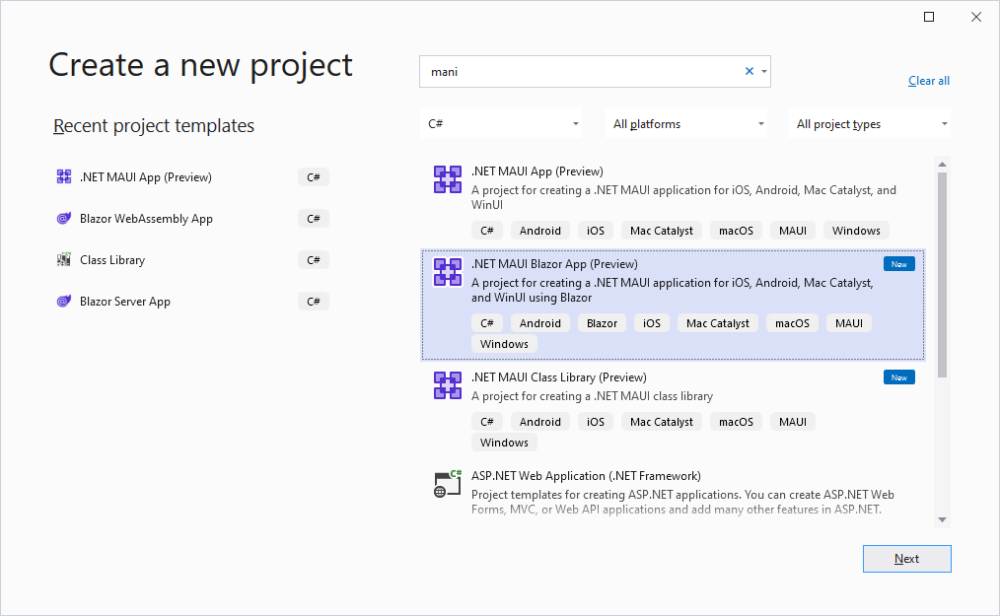

### My 1st MAUI Blazor app

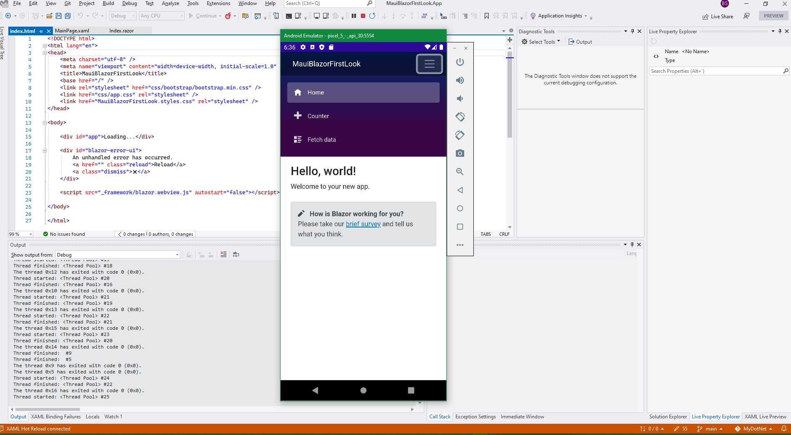

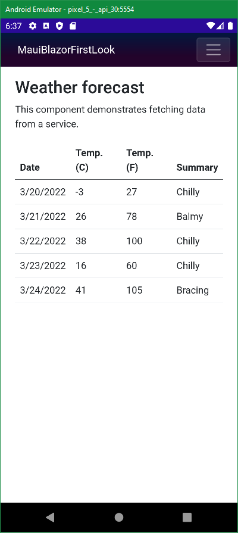

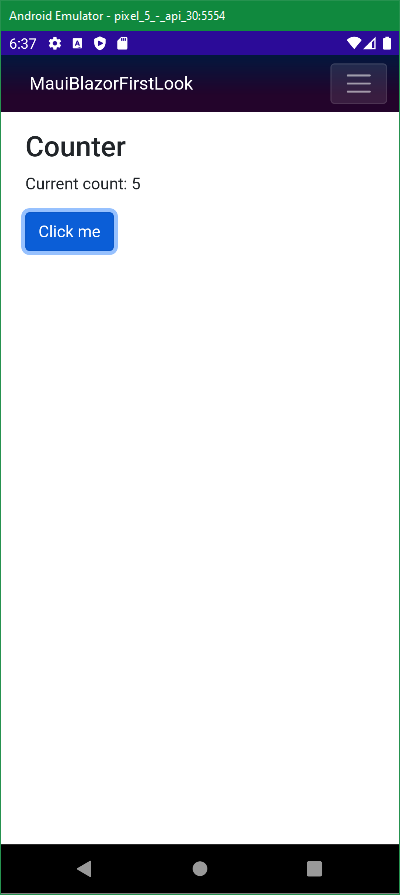

output

```
> am start -a "android.intent.action.MAIN" -c "android.intent.category.LAUNCHER" -n "com.companyname.mauiblazorfirstlook/crc64ba9e602e4ce2d282.MainActivity"
> Starting: Intent { act=android.intent.action.MAIN cat=[android.intent.category.LAUNCHER] cmp=com.companyname.mauiblazorfirstlook/crc64ba9e602e4ce2d282.MainActivity }
Loaded assembly: /data/data/com.companyname.mauiblazorfirstlook/files/.__override__/MauiBlazorFirstLook.dll
Loaded assembly: /data/data/com.companyname.mauiblazorfirstlook/files/.__override__/Mono.Android.dll [External]
Loaded assembly: /data/data/com.companyname.mauiblazorfirstlook/files/.__override__/System.Runtime.dll [External]
Loaded assembly: /data/data/com.companyname.mauiblazorfirstlook/files/.__override__/Java.Interop.dll [External]
Loaded assembly: /data/data/com.companyname.mauiblazorfirstlook/files/.__override__/System.Collections.dll [External]
Resolved pending breakpoint for 'Android.Runtime.JNIEnv.RegisterJniNatives(System.IntPtr, System.Int32, System.IntPtr, System.IntPtr, System.Int32)' to /Users/runner/work/1/s/xamarin-android/src/Mono.Android/Android.Runtime/JNIEnv.cs:124 [0x00000].
Loaded assembly: /data/data/com.companyname.mauiblazorfirstlook/files/.__override__/System.Threading.dll [External]
Loaded assembly: /data/data/com.companyname.mauiblazorfirstlook/files/.__override__/System.Runtime.InteropServices.dll [External]
Loaded assembly: /data/data/com.companyname.mauiblazorfirstlook/files/.__override__/System.Threading.Thread.dll [External]
Loaded assembly: /data/data/com.companyname.mauiblazorfirstlook/files/.__override__/System.Diagnostics.StackTrace.dll [External]
Loaded assembly: data-0x79cf1273c030 [External]
Loaded assembly: data-0x79cf1277c070 [External]
Loaded assembly: data-0x79cd0a4b7040 [External]
Loaded assembly: data-0x79cf1276c060 [External]
Loaded assembly: /data/data/com.companyname.mauiblazorfirstlook/files/.__override__/netstandard.dll [External]
Loaded assembly: /data/data/com.companyname.mauiblazorfirstlook/files/.__override__/System.Linq.dll [External]
Loaded assembly: /data/data/com.companyname.mauiblazorfirstlook/files/.__override__/System.Collections.Concurrent.dll [External]
Resolved pending breakpoint for 'Xamarin.HotReload.HotReloadAgent.BreakpointSendToIde(System.String)' to D:\a\_work\1\s\HotReload\Source\Xamarin.HotReload.Agent\HotReloadAgent.cs:415 [0x00000].
Loaded assembly: /data/data/com.companyname.mauiblazorfirstlook/files/.__override__/System.Text.Json.dll [External]
Loaded assembly: /data/data/com.companyname.mauiblazorfirstlook/files/.__override__/System.Text.Encodings.Web.dll [External]
Loaded assembly: /data/data/com.companyname.mauiblazorfirstlook/files/.__override__/System.ComponentModel.dll [External]
Loaded assembly: /data/data/com.companyname.mauiblazorfirstlook/files/.__override__/Microsoft.Maui.Controls.dll [External]
Loaded assembly: /data/data/com.companyname.mauiblazorfirstlook/files/.__override__/System.ObjectModel.dll [External]
Loaded assembly: /data/data/com.companyname.mauiblazorfirstlook/files/.__override__/Microsoft.Maui.dll [External]
Loaded assembly: /data/data/com.companyname.mauiblazorfirstlook/files/.__override__/Microsoft.Maui.Graphics.dll [External]
Loaded assembly: /data/data/com.companyname.mauiblazorfirstlook/files/.__override__/Microsoft.Maui.Essentials.dll [External]
Loaded assembly: /data/data/com.companyname.mauiblazorfirstlook/files/.__override__/Microsoft.Extensions.Logging.Abstractions.dll [External]
Loaded assembly: /data/data/com.companyname.mauiblazorfirstlook/files/.__override__/System.Runtime.Loader.dll [External]
Resolved pending breakpoint for 'Xamarin.HotReload.HotReloadAgent.BreakpointCheckpoint()' to D:\a\_work\1\s\HotReload\Source\Xamarin.HotReload.Agent\HotReloadAgent.cs:410 [0x00000].
Loaded assembly: /data/data/com.companyname.mauiblazorfirstlook/files/.__override__/System.Memory.dll [External]
Loaded assembly: /data/data/com.companyname.mauiblazorfirstlook/files/.__override__/System.Reflection.Emit.Lightweight.dll [External]
Loaded assembly: /data/data/com.companyname.mauiblazorfirstlook/files/.__override__/System.Reflection.Emit.ILGeneration.dll [External]
Loaded assembly: /data/data/com.companyname.mauiblazorfirstlook/files/.__override__/System.Reflection.Primitives.dll [External]
Loaded assembly: /data/data/com.companyname.mauiblazorfirstlook/files/.__override__/System.Runtime.CompilerServices.Unsafe.dll [External]
Loaded assembly: /data/data/com.companyname.mauiblazorfirstlook/files/.__override__/Xamarin.AndroidX.Core.dll [External]
Loaded assembly: /data/data/com.companyname.mauiblazorfirstlook/files/.__override__/Microsoft.Extensions.DependencyInjection.Abstractions.dll [External]
Loaded assembly: /data/data/com.companyname.mauiblazorfirstlook/files/.__override__/Microsoft.AspNetCore.Components.WebView.Maui.dll [External]
Loaded assembly: /data/data/com.companyname.mauiblazorfirstlook/files/.__override__/Microsoft.Maui.Controls.Compatibility.dll [External]
Loaded assembly: /data/data/com.companyname.mauiblazorfirstlook/files/.__override__/Microsoft.Extensions.Configuration.dll [External]
Loaded assembly: /data/data/com.companyname.mauiblazorfirstlook/files/.__override__/Microsoft.Extensions.Configuration.Abstractions.dll [External]
Loaded assembly: /data/data/com.companyname.mauiblazorfirstlook/files/.__override__/Microsoft.Extensions.Logging.dll [External]
Loaded assembly: /data/data/com.companyname.mauiblazorfirstlook/files/.__override__/Microsoft.AspNetCore.Components.WebView.dll [External]
Loaded assembly: /data/data/com.companyname.mauiblazorfirstlook/files/.__override__/Microsoft.Extensions.Primitives.dll [External]
Loaded assembly: /data/data/com.companyname.mauiblazorfirstlook/files/.__override__/Microsoft.Maui.Controls.Xaml.dll [External]
Loaded assembly: /data/data/com.companyname.mauiblazorfirstlook/files/.__override__/Xamarin.AndroidX.AppCompat.dll [External]
Loaded assembly: /data/data/com.companyname.mauiblazorfirstlook/files/.__override__/Xamarin.Google.Android.Material.dll [External]
Loaded assembly: /data/data/com.companyname.mauiblazorfirstlook/files/.__override__/System.ComponentModel.TypeConverter.dll [External]
Loaded assembly: /data/data/com.companyname.mauiblazorfirstlook/files/.__override__/System.Private.Uri.dll [External]
Loaded assembly: /data/data/com.companyname.mauiblazorfirstlook/files/.__override__/Xamarin.AndroidX.DrawerLayout.dll [External]
Loaded assembly: /data/data/com.companyname.mauiblazorfirstlook/files/.__override__/Xamarin.AndroidX.CustomView.dll [External]
Loaded assembly: /data/data/com.companyname.mauiblazorfirstlook/files/.__override__/Xamarin.AndroidX.Navigation.Runtime.dll [External]
Loaded assembly: /data/data/com.companyname.mauiblazorfirstlook/files/.__override__/Microsoft.JSInterop.dll [External]
Loaded assembly: /data/data/com.companyname.mauiblazorfirstlook/files/.__override__/Microsoft.AspNetCore.Components.dll [External]
Loaded assembly: /data/data/com.companyname.mauiblazorfirstlook/files/.__override__/Microsoft.Extensions.Options.dll [External]
Loaded assembly: /data/data/com.companyname.mauiblazorfirstlook/files/.__override__/Microsoft.Extensions.DependencyInjection.dll [External]
Loaded assembly: /data/data/com.companyname.mauiblazorfirstlook/files/.__override__/System.Diagnostics.Tracing.dll [External]
Loaded assembly: /data/data/com.companyname.mauiblazorfirstlook/files/.__override__/System.Linq.Expressions.dll [External]
Loaded assembly: /data/data/com.companyname.mauiblazorfirstlook/files/.__override__/System.Xml.ReaderWriter.dll [External]
Loaded assembly: /data/data/com.companyname.mauiblazorfirstlook/files/.__override__/System.Private.Xml.dll [External]
Loaded assembly: /data/data/com.companyname.mauiblazorfirstlook/files/.__override__/System.Text.Encoding.Extensions.dll [External]
Loaded assembly: /data/data/com.companyname.mauiblazorfirstlook/files/.__override__/System.Text.RegularExpressions.dll [External]
Loaded assembly: /data/data/com.companyname.mauiblazorfirstlook/files/.__override__/System.Numerics.Vectors.dll [External]
Loaded assembly: /data/data/com.companyname.mauiblazorfirstlook/files/.__override__/Microsoft.AspNetCore.Components.Web.dll [External]
Loaded assembly: /data/data/com.companyname.mauiblazorfirstlook/files/.__override__/Microsoft.Extensions.FileProviders.Abstractions.dll [External]
[blazorfirstloo] Late-enabling -Xcheck:jni
[blazorfirstloo] Unquickening 12 vdex files!
[blazorfirstloo] Unexpected CPU variant for X86 using defaults: x86_64
[NetworkSecurityConfig] No Network Security Config specified, using platform default
[NetworkSecurityConfig] No Network Security Config specified, using platform default
[debug-app-helper] Checking if libmonodroid was unpacked to /data/app/~~50gNnAE6G3Ad-cOrBbGX7w==/com.companyname.mauiblazorfirstlook-A2KT4PYrnKHibD7hjNPvGw==/lib/x86_64/libmonodroid.so
[debug-app-helper] Native libs extracted to /data/app/~~50gNnAE6G3Ad-cOrBbGX7w==/com.companyname.mauiblazorfirstlook-A2KT4PYrnKHibD7hjNPvGw==/lib/x86_64, assuming application/android:extractNativeLibs == true
[debug-app-helper] Setting up for DSO lookup in app data directories
[debug-app-helper] Added filesystem DSO lookup location: /data/app/~~50gNnAE6G3Ad-cOrBbGX7w==/com.companyname.mauiblazorfirstlook-A2KT4PYrnKHibD7hjNPvGw==/lib/x86_64
[debug-app-helper] Using runtime path: /data/app/~~50gNnAE6G3Ad-cOrBbGX7w==/com.companyname.mauiblazorfirstlook-A2KT4PYrnKHibD7hjNPvGw==/lib/x86_64
[debug-app-helper] checking directory: `/data/user/0/com.companyname.mauiblazorfirstlook/files/.__override__/lib`
[debug-app-helper] directory does not exist: `/data/user/0/com.companyname.mauiblazorfirstlook/files/.__override__/lib`
[debug-app-helper] Checking whether Mono runtime exists at: /data/user/0/com.companyname.mauiblazorfirstlook/files/.__override__/libmonosgen-2.0.so
[debug-app-helper] Checking whether Mono runtime exists at: /data/app/~~50gNnAE6G3Ad-cOrBbGX7w==/com.companyname.mauiblazorfirstlook-A2KT4PYrnKHibD7hjNPvGw==/lib/x86_64/libmonosgen-2.0.so
[debug-app-helper] Mono runtime found at: /data/app/~~50gNnAE6G3Ad-cOrBbGX7w==/com.companyname.mauiblazorfirstlook-A2KT4PYrnKHibD7hjNPvGw==/lib/x86_64/libmonosgen-2.0.so
[blazorfirstloo] Attempt to remove non-JNI local reference, dumping thread
[DOTNET] JNI_OnLoad: JNI_OnLoad in pal_jni.c
[monodroid] Creating public update directory: `/data/user/0/com.companyname.mauiblazorfirstlook/files/.__override__`
[blazorfirstloo] Attempt to remove non-JNI local reference, dumping thread
[monodroid-debug] Trying to initialize the debugger with options: --debugger-agent=transport=dt_socket,loglevel=0,address=10.0.2.2:52119,embedding=1
[monodroid-assembly] open_from_bundles: failed to load assembly MauiBlazorFirstLook.dll
[monodroid-gc] GREF GC Threshold: 46080
[monodroid-assembly] open_from_bundles: failed to load assembly Mono.Android.dll
[monodroid-assembly] open_from_bundles: failed to load assembly System.Runtime.dll
[monodroid-assembly] open_from_bundles: failed to load assembly Java.Interop.dll
[monodroid-assembly] open_from_bundles: failed to load assembly System.Collections.dll
[monodroid-assembly] open_from_bundles: failed to load assembly System.Threading.dll
[monodroid-assembly] open_from_bundles: failed to load assembly System.Runtime.InteropServices.dll
[monodroid-assembly] open_from_bundles: failed to load assembly System.Threading.Thread.dll
[monodroid-assembly] open_from_bundles: failed to load assembly System.Diagnostics.StackTrace.dll
[blazorfirstloo] Attempt to remove non-JNI local reference, dumping thread
[monodroid-assembly] open_from_bundles: failed to load assembly netstandard.dll
[monodroid-assembly] open_from_bundles: failed to load assembly System.Linq.dll
[monodroid-assembly] open_from_bundles: failed to load assembly Microsoft.VisualStudio.DesignTools.TapContract.dll
[monodroid-assembly] open_from_bundles: failed to load assembly Microsoft.VisualStudio.DesignTools.TapContract.dll
[monodroid-assembly] open_from_bundles: failed to load assembly Xamarin.HotReload.Contracts.dll
[monodroid-assembly] open_from_bundles: failed to load assembly Xamarin.HotReload.Contracts.dll
[monodroid-assembly] open_from_bundles: failed to load assembly System.Collections.Concurrent.dll
[monodroid-assembly] open_from_bundles: failed to load assembly System.Text.Json.dll
[monodroid-assembly] open_from_bundles: failed to load assembly System.Text.Encodings.Web.dll
[monodroid-assembly] open_from_bundles: failed to load assembly System.ComponentModel.dll
[monodroid-assembly] open_from_bundles: failed to load assembly Microsoft.Maui.Controls.dll
[monodroid-assembly] open_from_bundles: failed to load assembly Xamarin.HotReload.Contracts.dll
[monodroid-assembly] open_from_bundles: failed to load assembly Xamarin.HotReload.Contracts.dll
[monodroid-assembly] open_from_bundles: failed to load assembly Microsoft.VisualStudio.DesignTools.TapContract.dll
[monodroid-assembly] open_from_bundles: failed to load assembly Microsoft.VisualStudio.DesignTools.TapContract.dll
[monodroid-assembly] open_from_bundles: failed to load assembly System.ObjectModel.dll
[monodroid-assembly] open_from_bundles: failed to load assembly Microsoft.Maui.dll
[monodroid-assembly] open_from_bundles: failed to load assembly Microsoft.Maui.Graphics.dll
[monodroid-assembly] open_from_bundles: failed to load assembly Microsoft.Maui.Essentials.dll
[monodroid-assembly] open_from_bundles: failed to load assembly Microsoft.Extensions.Logging.Abstractions.dll
[monodroid-assembly] open_from_bundles: failed to load assembly System.Runtime.Loader.dll
[monodroid-assembly] open_from_bundles: failed to load assembly System.Memory.dll
[monodroid-assembly] open_from_bundles: failed to load assembly System.Reflection.Emit.Lightweight.dll
[monodroid-assembly] open_from_bundles: failed to load assembly System.Reflection.Emit.ILGeneration.dll
[monodroid-assembly] open_from_bundles: failed to load assembly System.Reflection.Primitives.dll
[monodroid-assembly] open_from_bundles: failed to load assembly System.Runtime.CompilerServices.Unsafe.dll
[monodroid-assembly] open_from_bundles: failed to load assembly Xamarin.AndroidX.Core.dll
[monodroid-assembly] open_from_bundles: failed to load assembly Microsoft.Extensions.DependencyInjection.Abstractions.dll
[monodroid-assembly] open_from_bundles: failed to load assembly Microsoft.AspNetCore.Components.WebView.Maui.dll
[monodroid-assembly] open_from_bundles: failed to load assembly Microsoft.Maui.Controls.Compatibility.dll
[monodroid-assembly] open_from_bundles: failed to load assembly Microsoft.Extensions.Configuration.dll
[monodroid-assembly] open_from_bundles: failed to load assembly Microsoft.Extensions.Configuration.Abstractions.dll
[monodroid-assembly] open_from_bundles: failed to load assembly Microsoft.Extensions.Logging.dll
[monodroid-assembly] open_from_bundles: failed to load assembly Microsoft.AspNetCore.Components.WebView.dll
[monodroid-assembly] open_from_bundles: failed to load assembly Microsoft.Extensions.Primitives.dll
[monodroid-assembly] open_from_bundles: failed to load assembly Microsoft.Maui.Controls.Xaml.dll
[monodroid-assembly] open_from_bundles: failed to load assembly Xamarin.AndroidX.AppCompat.dll
[monodroid-assembly] open_from_bundles: failed to load assembly Xamarin.Google.Android.Material.dll
[monodroid-assembly] open_from_bundles: failed to load assembly System.ComponentModel.TypeConverter.dll
[monodroid-assembly] open_from_bundles: failed to load assembly System.Private.Uri.dll
[monodroid-assembly] open_from_bundles: failed to load assembly Xamarin.AndroidX.DrawerLayout.dll
[monodroid-assembly] open_from_bundles: failed to load assembly Xamarin.AndroidX.CustomView.dll
[monodroid-assembly] open_from_bundles: failed to load assembly Xamarin.AndroidX.Navigation.Runtime.dll
[monodroid-assembly] open_from_bundles: failed to load assembly Microsoft.JSInterop.dll
[monodroid-assembly] open_from_bundles: failed to load assembly Microsoft.AspNetCore.Components.dll
[monodroid-assembly] open_from_bundles: failed to load assembly Microsoft.Extensions.Options.dll
[monodroid-assembly] open_from_bundles: failed to load assembly Microsoft.Extensions.DependencyInjection.dll
[monodroid-assembly] open_from_bundles: failed to load assembly System.Diagnostics.Tracing.dll
[monodroid-assembly] open_from_bundles: failed to load assembly System.Linq.Expressions.dll
[monodroid-assembly] open_from_bundles: failed to load assembly System.Xml.ReaderWriter.dll
[monodroid-assembly] open_from_bundles: failed to load assembly System.Private.Xml.dll
[monodroid-assembly] open_from_bundles: failed to load assembly System.Text.Encoding.Extensions.dll
[monodroid-assembly] open_from_bundles: failed to load assembly System.Text.RegularExpressions.dll
[monodroid-assembly] open_from_bundles: failed to load assembly System.Numerics.Vectors.dll
[monodroid-assembly] open_from_bundles: failed to load assembly Microsoft.AspNetCore.Components.Web.dll
[monodroid-assembly] open_from_bundles: failed to load assembly Microsoft.Extensions.FileProviders.Abstractions.dll
[monodroid-assembly] open_from_bundles: failed to load assembly Xamarin.AndroidX.SwipeRefreshLayout.dll
[monodroid-assembly] open_from_bundles: failed to load assembly Xamarin.AndroidX.CardView.dll
[monodroid-assembly] open_from_bundles: failed to load assembly Microsoft.Maui.Controls.Compatibility.Android.FormsViewGroup.dll
[monodroid-assembly] open_from_bundles: failed to load assembly Xamarin.AndroidX.RecyclerView.dll
[monodroid-assembly] open_from_bundles: failed to load assembly Xamarin.AndroidX.ViewPager.dll
[monodroid-assembly] open_from_bundles: failed to load assembly Xamarin.AndroidX.Fragment.dll
Loaded assembly: /data/data/com.companyname.mauiblazorfirstlook/files/.__override__/Xamarin.AndroidX.SwipeRefreshLayout.dll [External]
Loaded assembly: /data/data/com.companyname.mauiblazorfirstlook/files/.__override__/Xamarin.AndroidX.CardView.dll [External]
Loaded assembly: /data/data/com.companyname.mauiblazorfirstlook/files/.__override__/Microsoft.Maui.Controls.Compatibility.Android.FormsViewGroup.dll [External]
Loaded assembly: /data/data/com.companyname.mauiblazorfirstlook/files/.__override__/Xamarin.AndroidX.RecyclerView.dll [External]
Loaded assembly: /data/data/com.companyname.mauiblazorfirstlook/files/.__override__/Xamarin.AndroidX.ViewPager.dll [External]
Loaded assembly: /data/data/com.companyname.mauiblazorfirstlook/files/.__override__/Xamarin.AndroidX.Fragment.dll [External]
[libEGL] loaded /vendor/lib64/egl/libEGL_emulation.so
[libEGL] loaded /vendor/lib64/egl/libGLESv1_CM_emulation.so
[libEGL] loaded /vendor/lib64/egl/libGLESv2_emulation.so
[monodroid-assembly] open_from_bundles: failed to load assembly Xamarin.AndroidX.Activity.dll
[monodroid-assembly] open_from_bundles: failed to load assembly Xamarin.AndroidX.Lifecycle.Common.dll
[monodroid-assembly] open_from_bundles: failed to load assembly Xamarin.AndroidX.Lifecycle.ViewModel.dll
[monodroid-assembly] open_from_bundles: failed to load assembly Xamarin.AndroidX.SavedState.dll
[monodroid-assembly] open_from_bundles: failed to load assembly Xamarin.AndroidX.Loader.dll
Loaded assembly: /data/data/com.companyname.mauiblazorfirstlook/files/.__override__/Xamarin.AndroidX.Activity.dll [External]
Loaded assembly: /data/data/com.companyname.mauiblazorfirstlook/files/.__override__/Xamarin.AndroidX.Lifecycle.Common.dll [External]
Loaded assembly: /data/data/com.companyname.mauiblazorfirstlook/files/.__override__/Xamarin.AndroidX.Lifecycle.ViewModel.dll [External]
Loaded assembly: /data/data/com.companyname.mauiblazorfirstlook/files/.__override__/Xamarin.AndroidX.SavedState.dll [External]
Loaded assembly: /data/data/com.companyname.mauiblazorfirstlook/files/.__override__/Xamarin.AndroidX.Loader.dll [External]
Thread started:  #2
Thread started:  #3
Thread started:  #4
[monodroid-assembly] open_from_bundles: failed to load assembly System.Runtime.Serialization.Json.dll
[monodroid-assembly] open_from_bundles: failed to load assembly System.Private.DataContractSerialization.dll
[monodroid-assembly] open_from_bundles: failed to load assembly System.Runtime.Serialization.Xml.dll
Loaded assembly: /data/data/com.companyname.mauiblazorfirstlook/files/.__override__/System.Runtime.Serialization.Json.dll [External]
Loaded assembly: /data/data/com.companyname.mauiblazorfirstlook/files/.__override__/System.Private.DataContractSerialization.dll [External]
Loaded assembly: /data/data/com.companyname.mauiblazorfirstlook/files/.__override__/System.Runtime.Serialization.Xml.dll [External]
[monodroid-assembly] open_from_bundles: failed to load assembly System.Runtime.Serialization.Primitives.dll
Loaded assembly: /data/data/com.companyname.mauiblazorfirstlook/files/.__override__/System.Runtime.Serialization.Primitives.dll [External]
[monodroid-assembly] open_from_bundles: failed to load assembly Xamarin.AndroidX.CoordinatorLayout.dll
Loaded assembly: /data/data/com.companyname.mauiblazorfirstlook/files/.__override__/Xamarin.AndroidX.CoordinatorLayout.dll [External]
[WebViewFactory] Loading com.google.android.webview version 83.0.4103.106 (code 410410686)
[blazorfirstloo] The ClassLoaderContext is a special shared library.
[nativeloader] classloader namespace configured for unbundled product apk. library_path=/product/app/WebViewGoogle/lib/x86_64:/product/app/WebViewGoogle/WebViewGoogle.apk!/lib/x86_64:/product/app/TrichromeLibrary/TrichromeLibrary.apk!/lib/x86_64:/product/lib64:/system/product/lib64
[blazorfirstloo] The ClassLoaderContext is a special shared library.
[nativeloader] classloader namespace configured for unbundled product apk. library_path=/product/app/WebViewGoogle/lib/x86_64:/product/app/WebViewGoogle/WebViewGoogle.apk!/lib/x86_64:/product/app/TrichromeLibrary/TrichromeLibrary.apk!/lib/x86_64:/product/lib64:/system/product/lib64
[cr_LibraryLoader] Loaded native library version number "83.0.4103.106"
[cr_CachingUmaRecorder] Flushed 3 samples from 3 histograms.
[TetheringManager] registerTetheringEventCallback:com.companyname.mauiblazorfirstlook
[chromium] [ERROR:filesystem_posix.cc(62)] mkdir /data/user/0/com.companyname.mauiblazorfirstlook/cache/WebView/Crashpad: No such file or directory (2)
[monodroid-assembly] open_from_bundles: failed to load assembly Microsoft.Extensions.FileProviders.Embedded.dll
Loaded assembly: /data/data/com.companyname.mauiblazorfirstlook/files/.__override__/Microsoft.Extensions.FileProviders.Embedded.dll [External]
[monodroid-assembly] open_from_bundles: failed to load assembly Microsoft.Extensions.FileProviders.Composite.dll
Loaded assembly: /data/data/com.companyname.mauiblazorfirstlook/files/.__override__/Microsoft.Extensions.FileProviders.Composite.dll [External]
[monodroid-assembly] open_from_bundles: failed to load assembly System.Xml.XDocument.dll
[monodroid-assembly] open_from_bundles: failed to load assembly System.Private.Xml.Linq.dll
Loaded assembly: /data/data/com.companyname.mauiblazorfirstlook/files/.__override__/System.Xml.XDocument.dll [External]
Loaded assembly: /data/data/com.companyname.mauiblazorfirstlook/files/.__override__/System.Private.Xml.Linq.dll [External]
[blazorfirstloo] Accessing hidden method Landroid/media/AudioManager;->getOutputLatency(I)I (greylist, reflection, allowed)
[cr_media] Requires BLUETOOTH permission
[HostConnection] HostConnection::get() New Host Connection established 0x79cda2722950, tid 16280
[HostConnection] HostComposition ext ANDROID_EMU_CHECKSUM_HELPER_v1 ANDROID_EMU_native_sync_v2 ANDROID_EMU_native_sync_v3 ANDROID_EMU_native_sync_v4 ANDROID_EMU_dma_v1 ANDROID_EMU_direct_mem ANDROID_EMU_host_composition_v1 ANDROID_EMU_host_composition_v2 ANDROID_EMU_vulkan ANDROID_EMU_deferred_vulkan_commands ANDROID_EMU_vulkan_null_optional_strings ANDROID_EMU_vulkan_create_resources_with_requirements ANDROID_EMU_YUV_Cache ANDROID_EMU_vulkan_ignored_handles ANDROID_EMU_has_shared_slots_host_memory_allocator ANDROID_EMU_vulkan_free_memory_sync ANDROID_EMU_vulkan_shader_float16_int8 ANDROID_EMU_vulkan_async_queue_submit ANDROID_EMU_sync_buffer_data ANDROID_EMU_read_color_buffer_dma GL_OES_vertex_array_object GL_KHR_texture_compression_astc_ldr ANDROID_EMU_host_side_tracing ANDROID_EMU_gles_max_version_2
[chromium] [ERROR:gl_surface_egl.cc(549)] eglChooseConfig failed with error EGL_SUCCESS
[EGL_emulation] eglCreateContext: 0x79cd92786ad0: maj 2 min 0 rcv 2
[EGL_emulation] eglMakeCurrent: 0x79cd92786ad0: ver 2 0 (tinfo 0x79cd32cdf660) (first time)
[chromium] [ERROR:gl_surface_egl.cc(549)] eglChooseConfig failed with error EGL_SUCCESS
[VideoCapabilities] Unsupported profile 4 for video/mp4v-es
[cr_MediaCodecUtil] HW encoder for video/avc is not available on this device.
[EGL_emulation] eglCreateContext: 0x79cd9277a9a0: maj 2 min 0 rcv 2
[monodroid-assembly] open_from_bundles: failed to load assembly Xamarin.AndroidX.Lifecycle.LiveData.Core.dll
Loaded assembly: /data/data/com.companyname.mauiblazorfirstlook/files/.__override__/Xamarin.AndroidX.Lifecycle.LiveData.Core.dll [External]
[blazorfirstloo] Accessing hidden method Landroid/view/View;->computeFitSystemWindows(Landroid/graphics/Rect;Landroid/graphics/Rect;)Z (greylist, reflection, allowed)
[blazorfirstloo] Accessing hidden method Landroid/view/ViewGroup;->makeOptionalFitsSystemWindows()V (greylist, reflection, allowed)
Thread started:  #5
Thread started: .NET Timers #6
[Choreographer] Skipped 43 frames!  The application may be doing too much work on its main thread.
[HostConnection] HostConnection::get() New Host Connection established 0x79cda2723f10, tid 16206
[HostConnection] HostComposition ext ANDROID_EMU_CHECKSUM_HELPER_v1 ANDROID_EMU_native_sync_v2 ANDROID_EMU_native_sync_v3 ANDROID_EMU_native_sync_v4 ANDROID_EMU_dma_v1 ANDROID_EMU_direct_mem ANDROID_EMU_host_composition_v1 ANDROID_EMU_host_composition_v2 ANDROID_EMU_vulkan ANDROID_EMU_deferred_vulkan_commands ANDROID_EMU_vulkan_null_optional_strings ANDROID_EMU_vulkan_create_resources_with_requirements ANDROID_EMU_YUV_Cache ANDROID_EMU_vulkan_ignored_handles ANDROID_EMU_has_shared_slots_host_memory_allocator ANDROID_EMU_vulkan_free_memory_sync ANDROID_EMU_vulkan_shader_float16_int8 ANDROID_EMU_vulkan_async_queue_submit ANDROID_EMU_sync_buffer_data ANDROID_EMU_read_color_buffer_dma GL_OES_vertex_array_object GL_KHR_texture_compression_astc_ldr ANDROID_EMU_host_side_tracing ANDROID_EMU_gles_max_version_2
[OpenGLRenderer] Failed to choose config with EGL_SWAP_BEHAVIOR_PRESERVED, retrying without...
[EGL_emulation] eglCreateContext: 0x79cd92797d20: maj 2 min 0 rcv 2
[EGL_emulation] eglMakeCurrent: 0x79cd92797d20: ver 2 0 (tinfo 0x79cd32d79f50) (first time)
[Gralloc4] mapper 4.x is not supported
[HostConnection] createUnique: call
[HostConnection] HostConnection::get() New Host Connection established 0x79cda2723550, tid 16206
[goldfish-address-space] allocate: Ask for block of size 0x100
[goldfish-address-space] allocate: ioctl allocate returned offset 0x3f3ffe000 size 0x2000
[HostConnection] HostComposition ext ANDROID_EMU_CHECKSUM_HELPER_v1 ANDROID_EMU_native_sync_v2 ANDROID_EMU_native_sync_v3 ANDROID_EMU_native_sync_v4 ANDROID_EMU_dma_v1 ANDROID_EMU_direct_mem ANDROID_EMU_host_composition_v1 ANDROID_EMU_host_composition_v2 ANDROID_EMU_vulkan ANDROID_EMU_deferred_vulkan_commands ANDROID_EMU_vulkan_null_optional_strings ANDROID_EMU_vulkan_create_resources_with_requirements ANDROID_EMU_YUV_Cache ANDROID_EMU_vulkan_ignored_handles ANDROID_EMU_has_shared_slots_host_memory_allocator ANDROID_EMU_vulkan_free_memory_sync ANDROID_EMU_vulkan_shader_float16_int8 ANDROID_EMU_vulkan_async_queue_submit ANDROID_EMU_sync_buffer_data ANDROID_EMU_read_color_buffer_dma GL_OES_vertex_array_object GL_KHR_texture_compression_astc_ldr ANDROID_EMU_host_side_tracing ANDROID_EMU_gles_max_version_2
[OpenGLRenderer] Davey! duration=1017ms; Flags=1, IntendedVsync=1471659017069, Vsync=1472375683707, OldestInputEvent=9223372036854775807, NewestInputEvent=0, HandleInputStart=1472386997300, AnimationStart=1472387051900, PerformTraversalsStart=1472387585100, DrawStart=1472569943100, SyncQueued=1472614842000, SyncStart=1472617864400, IssueDrawCommandsStart=1472618037600, SwapBuffers=1472675073400, FrameCompleted=1472679041600, DequeueBufferDuration=1202100, QueueBufferDuration=1193900, GpuCompleted=412316860416,
Thread started:  #7
Thread started:  #8
Thread started:  #9
Thread started:  #10
[monodroid-assembly] open_from_bundles: failed to load assembly System.Runtime.Intrinsics.dll
Loaded assembly: /data/data/com.companyname.mauiblazorfirstlook/files/.__override__/System.Runtime.Intrinsics.dll [External]
Thread started: <Thread Pool> #11
Thread started: .NET ThreadPool Gate #12
Thread started: <Thread Pool> #13
Thread started: <Thread Pool> #14
Thread started: <Thread Pool> #15
Thread finished: <Thread Pool> #14
Thread finished: <Thread Pool> #13
The thread 0xe has exited with code 0 (0x0).
The thread 0xd has exited with code 0 (0x0).
Thread started: <Thread Pool> #16
Thread finished: <Thread Pool> #11
The thread 0xb has exited with code 0 (0x0).
Thread started: <Thread Pool> #17
Thread finished: <Thread Pool> #15
The thread 0xf has exited with code 0 (0x0).
Thread started: <Thread Pool> #18
Thread finished: <Thread Pool> #17
The thread 0x11 has exited with code 0 (0x0).
Thread started: <Thread Pool> #19
Thread finished: <Thread Pool> #18
The thread 0x12 has exited with code 0 (0x0).
Thread started: <Thread Pool> #20
Thread finished: <Thread Pool> #16
The thread 0x10 has exited with code 0 (0x0).
Thread started: <Thread Pool> #21
Thread finished: <Thread Pool> #19
The thread 0x13 has exited with code 0 (0x0).
Thread started: <Thread Pool> #22
Thread finished: <Thread Pool> #21
The thread 0x15 has exited with code 0 (0x0).
Thread started: <Thread Pool> #23
Thread finished: <Thread Pool> #20
The thread 0x14 has exited with code 0 (0x0).
Thread finished:  #9
Thread finished:  #5
The thread 0x9 has exited with code 0 (0x0).
The thread 0x5 has exited with code 0 (0x0).
Thread started: <Thread Pool> #24
Thread finished: <Thread Pool> #22
The thread 0x16 has exited with code 0 (0x0).
Thread started: <Thread Pool> #25
Thread finished: <Thread Pool> #24
The thread 0x18 has exited with code 0 (0x0).
Thread started: <Thread Pool> #26
Thread finished: <Thread Pool> #25
The thread 0x19 has exited with code 0 (0x0).
Thread started: <Thread Pool> #27
Thread finished: <Thread Pool> #23
The thread 0x17 has exited with code 0 (0x0).
```

## General

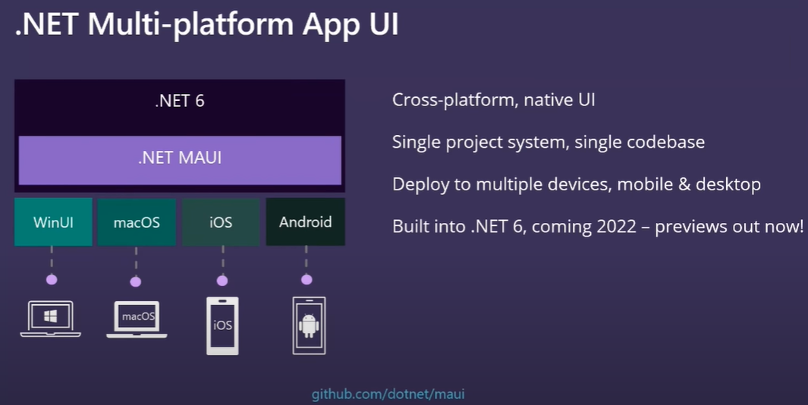


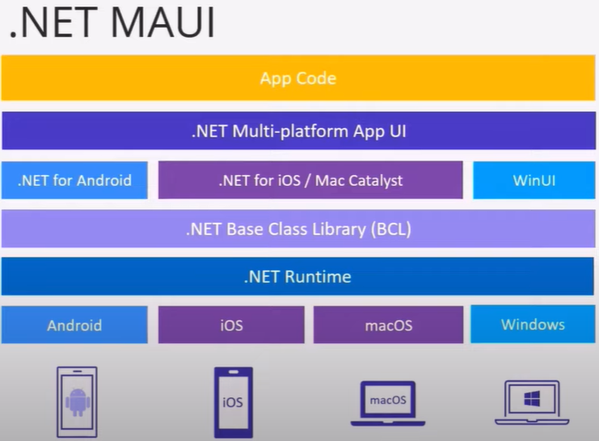

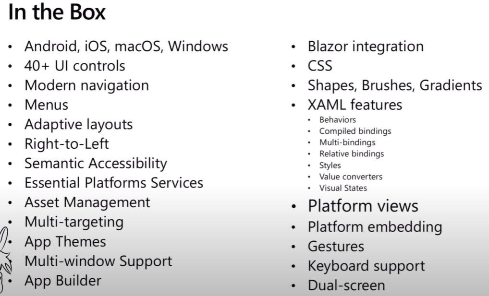


