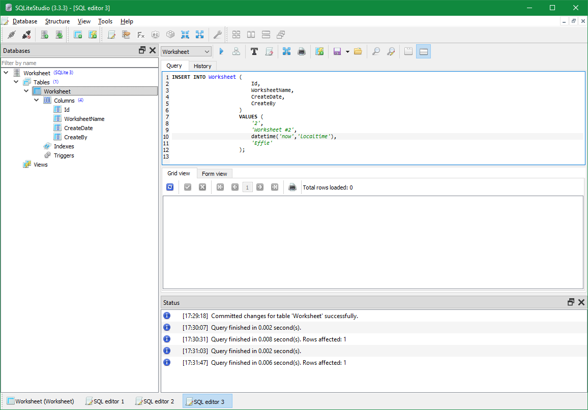
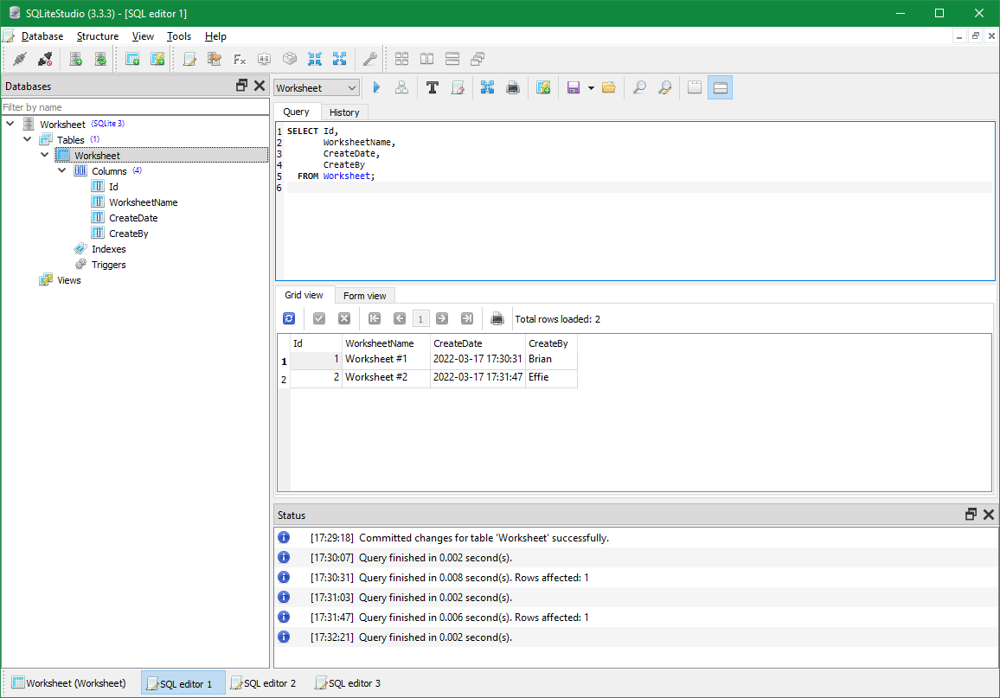

# Sqlite

C:\Apps\SQLiteStudio\

C:\CodeRepo\SqliteDB\Worksheet.db






```
drop table people;

CREATE TABLE [dbo].[People] (
    [Id]           INT             IDENTITY (1, 1) NOT NULL,
    [FirstName]    VARCHAR (50)  NOT NULL,
    [LastName]     VARCHAR (50)  NOT NULL,
    [DateOfBirth]  DATE            NULL,
    [EmailAddress] VARCHAR (100)  NULL,
    PRIMARY KEY CLUSTERED ([Id] ASC)
);
```
